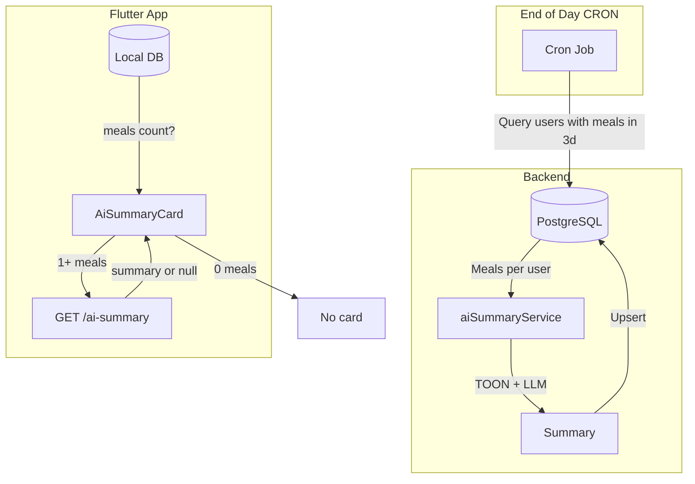

# AI Summary Dashboard Card (CRON + TOON)

## Overview

- **CRON-based generation**: A scheduled job runs at end of day and generates AI summaries for all users who logged at least one meal in the last 3 days.
- **Card visibility**: No meals logged (last 3 days) = no card. At least one meal = show card with pre-generated summary, or "Log more to get insights" if no summary yet.
- **TOON format**: Use Token-Oriented Object Notation to reduce token usage (~40-60% vs JSON) when sending meal data to the LLM.
- **Minimal meal data**: Send only essential fields (date, type, name, calories) to further save tokens.

---

## Architecture




**Data flow:**

1. CRON runs daily (e.g. 23:00 UTC). Queries `meals` table for users with meals in last 3 days.
2. For each user: encode meals in TOON, call LLM, store result in `ai_summaries` table.
3. App: `StreamBuilder` on `watchAllMealsForLast7Days()`; filter to last 3 days.
4. If 0 meals: do not render card.
5. If 1+ meals: fetch `GET /api/v1/food/ai-summary`. Show summary or "Log more to get insights".

---

## Prerequisite: Meal Data on Backend

Currently meal data lives only on device; sync is disabled. For CRON to work, the backend needs meal data. Two options:

**Option A (recommended):** Add `meals` table + sync endpoint. The Flutter [SyncService](app/lib/core/services/sync_service.dart) already enqueues meal upserts to `/api/v1/sync`; implement the sync route to persist to PostgreSQL and enable sync.

**Option B:** Use Firebase/Firestore if meals are already synced there. CRON would read from Firestore instead.

This plan assumes Option A: new migration `create_meals_table.sql` + sync route implementation.

---

## Key Files to Modify/Create

- **Backend**: `backend/migrations/create_meals_table.sql`, `backend/migrations/create_ai_summaries_table.sql`
- **Backend**: `backend/src/routes/v1/sync.ts` - Sync API to persist meals
- **Backend**: `backend/src/jobs/aiSummaryCron.ts` - CRON job logic
- **Backend**: `backend/src/services/aiSummaryService.ts` - TOON encode + OpenAI call
- **Backend**: [backend/src/routes/v1/food.ts](backend/src/routes/v1/food.ts) - Add `GET /ai-summary`
- **Backend**: [backend/package.json](backend/package.json) - Add `@toon-format/toon`, `node-cron`
- **App**: [app/lib/features/home/home_screen.dart](app/lib/features/home/home_screen.dart), `app/lib/features/home/widgets/ai_summary_card.dart`
- **App**: [app/lib/core/repositories/food_repository.dart](app/lib/core/repositories/food_repository.dart) - Add `getAiSummary()` (GET)
- **i18n**: [shared_packages/i18n/lib/i18n/en.i18n.json](shared_packages/i18n/lib/i18n/en.i18n.json)

---

## 1. Minimal Meal Data for LLM (TOON)

Send only 4 fields per meal to minimize tokens:


| Field | Example    | Notes                                   |
| ----- | ---------- | --------------------------------------- |
| date  | 2025-02-09 | YYYY-MM-DD                              |
| type  | B          | B=Breakfast, L=Lunch, D=Dinner, S=Snack |
| name  | Oatmeal    | Short name, max ~25 chars               |
| cal   | 280        | Calories                                |


**TOON encoding** (using `@toon-format/toon`):

```ts
import { encode } from '@toon-format/toon';
const meals = [
  { date: '2025-02-09', type: 'B', name: 'Oatmeal', cal: 280 },
  { date: '2025-02-09', type: 'L', name: 'Chicken salad', cal: 450 },
];
const toonPayload = encode({ meals });
```

Example output (~40-60% fewer tokens than JSON):

```
meals[2]{date,type,name,cal}:
2025-02-09,B,Oatmeal,280
2025-02-09,L,Chicken salad,450
```

---

## 2. Backend: aiSummaryService

- **Input**: Array of minimal meal objects, locale.
- **Process**: Encode to TOON, build prompt, call `gpt-4o-mini` with `response_format: { type: "json_object" }`.
- **Output**: JSON `{"summary": "..."}`.

**System prompt:**

- You are a nutrition insight AI. Given TOON-formatted meal data from the last 3 days, write a 2-3 sentence summary.
- **Critical:** Users often do NOT log every meal. Data is incomplete. Never assume low calories = dieting or high = overeating.
- Frame as "Based on what you've logged..." or "Your logged meals suggest...". Be encouraging, non-judgmental.
- Output language must match locale. Return JSON only: `{"summary":"..."}`.

---

## 3. CRON Job

- **Schedule**: Daily at end of day (e.g. `0 23 * * *` = 23:00 UTC).
- **Query**: `SELECT DISTINCT user_id FROM meals WHERE created_at >= NOW() - INTERVAL '3 days'`.
- **For each user**: Fetch meals (last 3 days), encode to TOON, call `aiSummaryService`, upsert into `ai_summaries(user_id, summary, generated_at)`.
- **Rate limiting**: Process in batches to avoid OpenAI rate limits; consider queue (Bull, etc.) for scale.

---

## 4. API: GET /api/v1/food/ai-summary

- **Auth**: Required (Firebase token).
- **Response**: `{ "summary": "string" | null }`. Null if no summary generated yet.
- **Logic**: Read from `ai_summaries` for current user. Return latest row (by `generated_at`).

---

## 5. Flutter: AiSummaryCard

- **StreamBuilder** on `watchAllMealsForLast7Days()`; filter to last 3 days by `dateTime`.
- **If 0 meals in 3 days**: Return `SizedBox.shrink()` — no card.
- **If 1+ meals**: Render card. Call `FoodRepository.getAiSummary()` (GET).
  - Loading: "Loading..."
  - Has summary: Display text.
  - No summary (null): "Log more meals over the next few days to get your personalized AI insights."
- Styled like [daily_summary.dart](app/lib/features/home/widgets/daily_summary.dart).

---

## 6. i18n

```json
"aiSummary": {
  "title": "Your AI Summary",
  "logMore": "Log more meals over the next few days to get your personalized AI insights.",
  "loading": "Loading..."
}
```

---

## 7. Edge Cases


| Case                     | Handling                                    |
| ------------------------ | ------------------------------------------- |
| 0 meals in 3 days        | No card rendered                            |
| 1+ meals, no summary yet | Card with "Log more to get insights"        |
| CRON failed for user     | Same as no summary; next run will retry     |
| User timezone            | CRON uses UTC; "end of day" is configurable |


---

## 8. Implementation Order

1. Migration: `create_meals_table.sql` + `create_ai_summaries_table.sql`
2. Sync route: Persist meals from `SyncBatch` to `meals` table; enable SyncService in app
3. aiSummaryService: TOON encode + OpenAI, with minimal meal schema
4. CRON job: Query users, generate summaries, store in `ai_summaries`
5. GET /ai-summary route
6. FoodRepository.getAiSummary()
7. AiSummaryCard widget + HomeScreen integration
8. i18n

