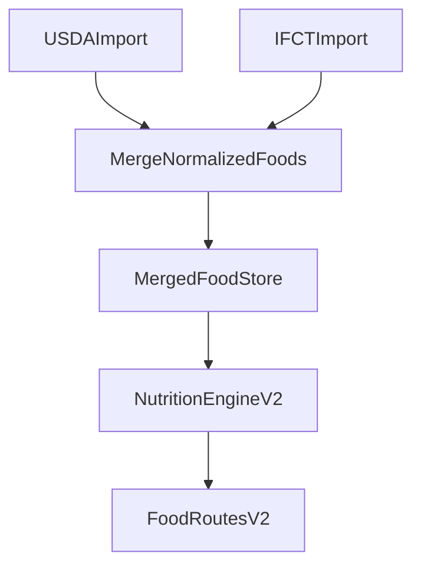

# USDA and Indian Food Database Plan

## Recommendation

**Yes, you should include an Indian food database** if your users log Indian meals with any regularity.

Why:

- the live V2 engine already assumes mixed cuisine input and already contains Indian aliases plus a few `IFCT` rows in [backend/src/services/nutritionEngineV2.ts](backend/src/services/nutritionEngineV2.ts) and [backend/src/scripts/usda-foods-sample.json](backend/src/scripts/usda-foods-sample.json)
- USDA alone is weak for common Indian foods like dal variants, paneer, roti styles, regional dishes, and cooking defaults
- the repo already shows the intended direction: one merged grounding layer rather than separate “US” vs “India” codepaths

Recommendation nuance:

- **Include it** if food accuracy for Indian meals matters to the product
- **Do not block launch on a full IFCT import** if you only need a first useful version; start with a curated merged dataset, then formalize imports

## Current State

- The live V2 runtime loads a single flat JSON food store in [backend/src/services/nutritionEngineV2.ts](backend/src/services/nutritionEngineV2.ts).
- That JSON already contains rows with `source: "USDA"` and `source: "IFCT"` in [backend/src/scripts/usda-foods-sample.json](backend/src/scripts/usda-foods-sample.json).
- Matching is one-pass alias/exact/fuzzy over the merged in-memory list, not separate source-specific routing.
- The bulk import path is USDA-only today via [backend/src/scripts/import-usda.ts](backend/src/scripts/import-usda.ts) and [backend/migrations/20260223_create_usda_foods.sql](backend/migrations/20260223_create_usda_foods.sql).
- There is no IFCT import script, no IFCT table, and no provenance-aware runtime selection yet.

## Suggested Approach

### Phase 1: Keep one merged runtime database

Use a **single merged food grounding store** for V2 instead of branching the engine by country.

Why this is the right default:

- it matches the current architecture in [backend/src/services/nutritionEngineV2.ts](backend/src/services/nutritionEngineV2.ts)
- it lets one meal contain both USDA-backed and Indian-backed ingredients
- it avoids maintaining separate matching logic per cuisine

### Phase 2: Make source provenance first-class

Extend the V2 ingredient DTOs in [backend/src/services/nutritionEngineV2.ts](backend/src/services/nutritionEngineV2.ts) to include the food database source when the ingredient comes from DB.

Add fields like:

- `database_source: 'USDA' | 'IFCT'`
- optional `database_food_id`

This will help with debugging, analytics, and trust in the UI.

### Phase 3: Formalize Indian data ingestion

Add a dedicated Indian dataset import path rather than keeping IFCT as a few hand-curated rows inside [backend/src/scripts/usda-foods-sample.json](backend/src/scripts/usda-foods-sample.json).

Add:

- a new import script next to [backend/src/scripts/import-usda.ts](backend/src/scripts/import-usda.ts)
- a normalized merged output artifact or merged DB table
- explicit source attribution and licensing notes

### Phase 4: Standardize the merged schema

Define one shared schema for runtime food rows, regardless of source:

- `id`
- `canonical_name`
- macros per 100g
- default weight
- `source`
- optional source-native identifier
- optional aliases / regional names

Use that schema for both:

- the in-memory merged JSON path used by [backend/src/services/nutritionEngineV2.ts](backend/src/services/nutritionEngineV2.ts)
- any future DB-backed merged table

### Phase 5: Decide storage strategy

Two valid implementations:

- **Simple and fast**: keep a merged JSON artifact and load it in memory
- **More scalable**: create a merged SQL table and import both USDA and IFCT into it

For this repo, I recommend:

- **short term**: merged JSON artifact because the live V2 engine already works this way
- **medium term**: merged DB table once coverage grows and you need better maintenance/querying

## Concrete File Plan

### 1. Keep V2 engine on a merged dataset

Use [backend/src/services/nutritionEngineV2.ts](backend/src/services/nutritionEngineV2.ts) as the canonical runtime grounding path.

Update it to:

- preserve and expose `FoodEntry.source`
- optionally expose per-ingredient provenance in streamed V2 responses

### 2. Split data ingestion by source, merge before runtime

Add a new Indian import script under [backend/src/scripts](backend/src/scripts).

Keep [backend/src/scripts/import-usda.ts](backend/src/scripts/import-usda.ts) for USDA.

Then add a merge step that produces either:

- an updated merged JSON artifact used by [backend/src/services/nutritionEngineV2.ts](backend/src/services/nutritionEngineV2.ts), or
- a merged SQL table for future runtime lookup

### 3. Avoid source-specific engine branches

Do not create separate `USDA` vs `IFCT` lookup services in the runtime path.

Instead:

- keep one matcher
- merge datasets into one runtime index
- use aliases and provenance to improve precision

### 4. Expand aliases with source-backed rows

The alias block in [backend/src/services/nutritionEngineV2.ts](backend/src/services/nutritionEngineV2.ts) already includes Indian terms such as `roti`, `dal`, `paneer`, `dahi`, `rajma`, and others.

As Indian coverage improves:

- align aliases to real IFCT-backed canonical rows where available
- reduce cases where Indian foods are forced onto approximate USDA substitutes

### 5. Add validation and QA for merged foods

Before shipping a larger merged database, add checks for:

- duplicate canonical names across sources
- inconsistent units
- missing macros
- unrealistic defaults
- collisions where an Indian alias maps to the wrong USDA row

## Recommended Decision

You should include Indian food data if:

- India is a target market
- Indian diaspora users are expected
- users commonly log mixed meals like roti + dal + paneer + rice

You can skip a full Indian import only if:

- the product is narrowly US-focused
- approximate mapping is acceptable
- Indian meal accuracy is not a product goal

Given the existing aliases and partial `IFCT` rows already in the repo, the codebase is already leaning toward **including it**.

## Architecture Diagram

## Implementation Order

1. Keep [backend/src/services/nutritionEngineV2.ts](backend/src/services/nutritionEngineV2.ts) as the single runtime grounding path.
2. Expose `source` in V2 resolved ingredient payloads.
3. Add a dedicated Indian dataset import script under [backend/src/scripts](backend/src/scripts).
4. Merge USDA and Indian rows into one normalized artifact or merged table.
5. Expand aliases and QA checks so Indian foods resolve to source-appropriate rows.
6. If dataset size grows materially, move from merged JSON to a merged DB-backed runtime table.

