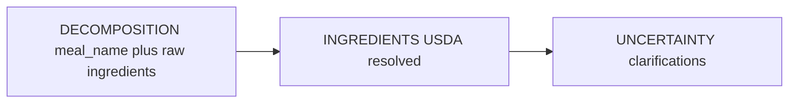

# Meal analysis sheet + portion clarifications

## Context (current behavior)

- The sheet header always uses [`t.meal.analysis.title`](shared_packages/i18n/lib/i18n/en.i18n.json) (“Analyzing your meal”). [`MealAnalysisPipelineEvent.mealName`](shared_packages/models/lib/src/meal_analysis_pipeline_event.dart) already resolves `decomposition.mealName` first, then `result.mealName`; [`PipelineDecompositionData`](protos/calorify/meal_analysis_pipeline.proto) carries `meal_name`.
- Below the loader, [`_emergingPreviewContent`](app/lib/features/home/widgets/bottom_sheet/meal_analysis_sheet.dart) repeats the meal title when present (lines ~405–483), creating duplication once the header shows the same name (**your choice**: remove only this inner title).
- Ingredient strings come from `_detectedIngredientNames`, which prefers `INGREDIENTS`-step canonical names over `DECOMPOSITION`/`RESULT`. A later event can logically drop rows if payloads differ; you want a **monotonic union** once names appear.
- Backend V2 emits `DECOMPOSITION` with [`meal_name` + ingredients](backend/src/services/nutritionEngineV2.ts) before USDA resolution; clarifications use [`generateClarifications`](backend/src/services/nutritionEngineV2.ts) with templated **`Small (~${minGrams}g)` / etc.** The same pattern exists in legacy [`nutritionEngine.ts`](backend/src/services/nutritionEngine.ts). Pipeline questions use `option.label` in [`MealQuestionFlowSheet`](app/lib/features/home/widgets/bottom_sheet/meal_question_flow_sheet.dart) (lines 136–139).

## 1–2. Header title + duplicate meal line (Flutter)

**Files:** [`app/lib/features/home/widgets/bottom_sheet/meal_analysis_sheet.dart`](app/lib/features/home/widgets/bottom_sheet/meal_analysis_sheet.dart)

- Replace the top `Text(t.meal.analysis.title, ...)` with: when `mealName` is non-empty after trim, show that as the main title (reuse `titleLarge` / same weight as today); otherwise keep the existing generic title.
- In `_emergingPreviewContent`, **stop rendering the `mealTitle` block** when the header already shows the meal name (pass a flag like `hideMealTitleInPreview: hasHeaderMealName`), so the ingredient block only shows the “detected ingredients” section + list (per your clarification).

Optional copy polish: if designers want a subtitle when the headline is the meal name, that can be a follow-up; scope here is title + no duplicate name in the preview.

## 3. Ingredients never disappear once shown (Flutter)

**File:** same [`meal_analysis_sheet.dart`](app/lib/features/home/widgets/bottom_sheet/meal_analysis_sheet.dart)

- Add state on `_MealAnalysisPipelineSheetState`, e.g. `List<String> _accumulatedIngredientNames`, updated on each streamed event by **merging** `_detectedIngredientNames(event)` into the set (preserve first-seen order, de-dup case-insensitively or by exact string—match existing typography).
- Feed `_emergingPreviewContent` with `accumulated` instead of only the latest `_detectedIngredientNames(_lastEvent)`, so a step that omits ingredients does not clear the list.

**Edge case:** Consider whether resolution should **replace** decomposition labels for the same semantic row (hard without IDs). Pragmatic approach: union of display strings is acceptable for loading UX; full alignment with backend row identity can be a later refinement.

**Sanity check:** When the sheet dismisses on `RESULT` / error / clarify, no need to persist accumulation across sessions.

## 4. Meal name “early” from server (mostly verification + small tweaks)

- **Already in place:** decomposition event includes `meal_name` in [`PipelineDecompositionData`](protos/calorify/meal_analysis_pipeline.proto); V2 yields it in [`runPipelineFromDecomposition`](backend/src/services/nutritionEngineV2.ts).
- **Engineering work:** Review the decomposition LLM prompt/schema (where `LLMDecomposition` is produced) to ensure `meal_name` is reliably filled and concise for the header. If streaming ever batches events, confirm the client rebuilds when `meal_name` first appears ([`_shouldRebuildForDisplay`](app/lib/features/home/widgets/bottom_sheet/meal_analysis_sheet.dart) already compares names).
- **No proto change required** unless you discover the model cannot supply a title without a new field.

## 5. Portion-based variation / clarification (large backend + contract work)

**Problem:** Clarification labels expose **grams** (`Small (~Xm)g`) from `generateClarifications` in [`nutritionEngineV2.ts`](backend/src/services/nutritionEngineV2.ts). Users think in **pieces, rotis, bowls, cups**, not grams.

**Target behavior (example):** “Paneer with 4 roti” → ask **paneer portion** in natural units and **roti size/count** separately, then estimate total mass and calories from per-100g USDA (or LLM fallback) data.

**Recommended approach (phased):**

1. **Enrich decomposition output (LLM JSON)** per ingredient with something like: `portion_kind` (e.g. `count`, `weight`, `volume`), `user_facing_unit` (e.g. `roti`, `slice`, `cup`), optional `count_hint` from user text, and **internal** `grams_estimated` / min / max (keep existing numeric pipeline).
2. **`generateClarifications` redesign:** Replace fixed small/medium/large gram labels with **ingredient-specific option sets**:
   - Prefer **predefined templates** from `portion_kind` (e.g. roti: “1 small”, “1 regular”, “1 large” with mapped gram ranges) to stay accurate and bounded.
   - Optional: one **short LLM pass** to phrase 3 options as natural language from structured `(min, likely, max)` grams — still no raw grams in the label unless you add a subtle suffix for power users.
3. **Proto:** Keep [`PipelineClarificationOption`](protos/calorify/meal_analysis_pipeline.proto) `grams` + `calorie_delta` for math; add optional fields if needed (e.g. `portion_label` vs `internal_grams`, or `option_id`) so the app can show labels without parsing strings. Run `./scripts/generate_protos.sh` and update Dart/TS.
4. **`MealDetectionResponse.variations` (V1):** Prompt/schema in [`openAIFoodAnalysis.ts`](backend/src/services/openAIFoodAnalysis.ts) should stress **portion and identity** wording, not grams, in `Variation.Option.option` text; validate with a few fixtures in tests.
5. **Tests:** Extend [`nutritionEngineV2.test.ts`](backend/src/services/nutritionEngineV2.test.ts) and clarification tests to assert labels do not contain raw gram patterns where policy says not to, and that selected options still map to updated `grams`.

**Accuracy note:** All user-facing copy should map to **validated gram buckets** per food category so calorie deltas stay consistent with USDA density.

## Suggested implementation order

1. Flutter: header title + suppress duplicate meal line in preview (**1–2**).
2. Flutter: accumulated ingredient names (**3**).
3. Backend: prompt/label pass for decomposition `meal_name` if gaps found (**4**).
4. Backend/proto: portion-aware clarifications (**5**) as a separate milestone with its own QA (multi-ingredient text like your paneer + roti example).

