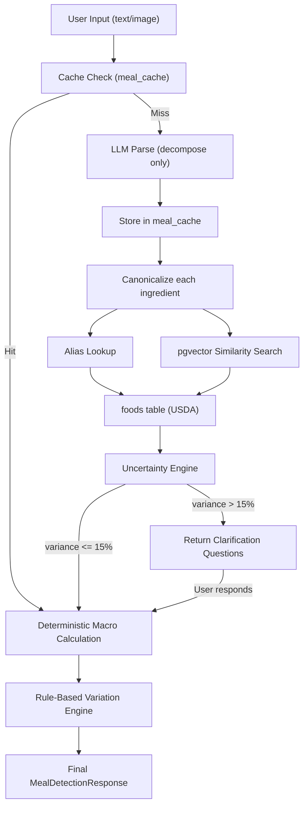

# Calorify Nutrition Engine -- Implementation Plan

## Current State

The backend ([backend/src/services/openAIFoodAnalysis.ts](backend/src/services/openAIFoodAnalysis.ts)) currently uses OpenAI GPT-4.1-nano to analyze food images/text and **directly generate macro values** (calories, protein, carbs, fat, fiber). There is no authoritative food database -- the LLM is the sole source of truth for nutritional data.

The proposed plan replaces this with a **deterministic pipeline** where the LLM only decomposes meals into ingredients + gram estimates, and all macro computation is done against a USDA-backed Postgres database with pgvector similarity search.

---

## Implementation Phases

### Phase 1 -- Database Setup (pgvector + USDA)

**Goal:** Stand up the foundational food database with vector search capability.

**Files to create/modify:**

- `backend/migrations/001_create_foods_table.sql` -- foods, food_aliases, meal_cache, user_preferences tables
- `backend/src/services/database.ts` -- extend existing pool to support pgvector
- `backend/src/scripts/importUSDA.ts` -- USDA Foundation Foods import script
- `backend/src/scripts/generateEmbeddings.ts` -- embed canonical food names

**Key decisions:**

- Embedding model: Use OpenAI `text-embedding-3-small` (1536-dim) or a smaller model. The plan specifies 768-dim vectors -- this matches `text-embedding-3-small` with `dimensions: 768` parameter.
- USDA data source: Download Foundation Foods CSV/JSON from [FoodData Central](https://fdc.nal.usda.gov/download-datasets). Filter to atomic ingredients only (~2,000 items).
- Tables: `foods`, `food_aliases`, `meal_cache`, `user_preferences` (exact schemas from plan doc).

**Steps:**

1. Enable pgvector extension in Postgres
2. Create migration files for all 4 tables with indexes
3. Write USDA import script: download, parse, filter composites, insert into `foods`
4. Generate embeddings for all `canonical_name` values and store in `embedding` column
5. Run `ANALYZE foods` for index optimization

---

### Phase 2 -- Alias Strategy & Canonicalization Service

**Goal:** Build the food matching pipeline that maps user-facing food names to canonical DB entries.

**Files to create:**

- `backend/src/services/canonicalization.ts` -- normalization + alias lookup + vector search
- `backend/src/data/aliases.json` -- curated regional alias dictionary

**Pipeline:**

1. **Normalize** input: lowercase, strip punctuation, remove stopwords, singularize, normalize units
2. **Exact match** against `food_aliases.alias` column
3. **Embedding search** if no exact match: embed normalized input, cosine similarity search against `foods.embedding` and `food_aliases.embedding`, accept if similarity > 0.85
4. **Fallback**: log unmatched term for manual review, return `null` match

**Key code pattern:**

```typescript
interface CanonicalMatch {
  foodId: string;
  canonicalName: string;
  similarity: number;
  matchType: 'exact_alias' | 'embedding' | 'unmatched';
}

async function canonicalize(rawName: string): Promise<CanonicalMatch>
```

---

### Phase 3 -- LLM Parsing Layer (Decomposition Only)

**Goal:** Replace the current LLM-as-source-of-truth approach with LLM-as-parser.

**Files to modify/create:**

- `backend/src/services/foodAnalysisSystemPrompt.ts` -- new decomposition-only prompt
- `backend/src/services/llmParser.ts` -- new parsing service
- `backend/src/services/openAIFoodAnalysis.ts` -- refactor to use new pipeline

**LLM contract:** The LLM receives a food description (or image) and returns ONLY:

```json
{
  "ingredients": [
    {
      "raw_name": "basmati rice",
      "components": [
        { "name": "basmati rice", "grams_estimated": 150, "uncertainty": { "type": "range", "min_grams": 120, "max_grams": 180 } }
      ]
    }
  ],
  "confidence": 0.85
}
```

The LLM must NEVER return macro values. It only estimates grams and flags uncertainty.

**Migration path:** Keep the existing `openAIFoodAnalysis.ts` endpoints functional and introduce the new pipeline behind a feature flag or as new `/v2/` endpoints, allowing gradual rollout.

---

### Phase 4 -- Uncertainty Engine

**Goal:** Quantify and act on estimation uncertainty.

**Files to create:**

- `backend/src/services/uncertaintyEngine.ts`

**Logic:**

- For each ingredient with uncertainty metadata, compute `min_kcal` and `max_kcal`
- Aggregate across all ingredients: `variance_percent = (max_total - min_total) / avg_total`
- If `variance_percent > 0.15`: generate clarification questions (maps to existing `Variation` protobuf)
- Else: use default (midpoint) estimate

**Integration:** The uncertainty engine feeds into the existing `Variation` protobuf type already supported by the frontend, so the clarification UI is already built.

---

### Phase 5 -- Deterministic Macro Computation

**Goal:** Pure arithmetic macro calculation from DB values.

**Files to create:**

- `backend/src/services/macroCalculator.ts`

**Core formula:**

```typescript
function calculateMacros(foodId: string, grams: number): MealMacro {
  const food = await getFoodById(foodId);
  return {
    calories: (grams / 100) * food.kcal_per_100g,
    protein: (grams / 100) * food.protein_per_100g,
    carbs: (grams / 100) * food.carbs_per_100g,
    fat: (grams / 100) * food.fat_per_100g,
    fiber: (grams / 100) * (food.fiber_per_100g ?? 0),
  };
}
```

Aggregate across all resolved ingredients to produce the final `MealMacro`.

---

### Phase 6 -- Variation Engine (Rule-Based)

**Goal:** Generate deterministic meal variations without LLM.

**Files to create:**

- `backend/src/services/variationEngine.ts`

**Rules:**

- **Low oil**: reduce oil/ghee/butter components by 50%
- **Reduced portion**: scale all components by 0.75x
- **High protein**: suggest protein substitutions from a curated map
- **Sensitivity band**: show min/max kcal from uncertainty data

---

### Phase 7 -- Caching Layer

**Goal:** Avoid redundant LLM calls for repeated meals.

**Files to modify:**

- `backend/src/services/llmParser.ts` -- add cache check before LLM call

**Flow:**

1. Normalize input text
2. Check `meal_cache` table (exact match on `normalized_text`, or embedding similarity)
3. Cache hit: return stored `parsed_output`
4. Cache miss: call LLM, store result in `meal_cache`

---

### Phase 8 -- API Integration & Route Updates

**Goal:** Wire everything together and expose via API.

**Files to modify:**

- `backend/src/routes/v1/food.ts` -- add new v2 endpoints or update existing ones
- Update protobuf definitions if needed for new response fields (uncertainty data, variation details)

**New endpoint flow:**

```
POST /api/v1/food/detect-text (or /api/v2/food/analyze)
  → Cache check
  → LLM parse (decompose only)
  → Canonicalize each ingredient
  → Uncertainty check → maybe return clarification questions
  → Deterministic macro calc
  → Variation engine
  → Return MealDetectionResponse
```

---

## Data Flow Diagram




---

## Critical Evaluation

### Strengths

1. **Deterministic macros are the right call.** LLM-generated nutritional values are unreliable and non-reproducible. Moving to a USDA-backed database with arithmetic computation eliminates a major source of error.
2. **Uncertainty modeling is sophisticated.** The range/variant/boolean uncertainty types cover real-world ambiguity well. Tying variance thresholds to user clarification prompts is a good UX pattern.
3. **Caching layer is valuable.** Meals are repetitive ("2 roti with dal" appears thousands of times). Caching parsed LLM output dramatically reduces cost and latency.
4. **pgvector for food matching is appropriate.** Embedding-based similarity search handles spelling variations, abbreviations, and partial matches better than exact string matching.
5. **Existing protobuf `Variation` type** already supports the clarification flow, reducing frontend work.

### Weaknesses and Risks

1. **USDA Foundation Foods has ~2,000 atomic ingredients and is US-centric.** The app supports 30+ locales including Hindi, Bengali, Telugu, Gujarati, Urdu -- all markets where regional foods (paneer, ghee, jaggery, specific dal varieties, regional breads) may have poor or no USDA coverage. **Mitigation:** Supplement USDA with IFCT (Indian Food Composition Tables) and other regional databases. The plan does not mention this.
2. **"No composite dishes" is a critical gap.** Users don't say "150g rice + 30g dal + 10ml oil." They say "dal chawal" or "chicken biryani." The plan relies entirely on the LLM to decompose composites into atomic ingredients with gram estimates -- this is the hardest part and the plan underspecifies it. **LLM decomposition accuracy for complex dishes is the single biggest risk.**
3. **Manual alias curation doesn't scale for 30+ locales.** The plan says "never auto-create aliases at runtime" and requires manual batch promotion. For an app serving users in Arabic, Vietnamese, Thai, etc., manually curating aliases in each language is a massive operational burden. **Consider:** Semi-automated alias generation with human-in-the-loop review rather than pure manual curation.
4. **Gram estimation by LLM is still a major LLM dependency.** The plan says "LLM only for parsing" but gram estimation is not parsing -- it's nutritional judgment. Whether a bowl of rice is 150g or 250g changes the calorie count by 40%. The plan's uncertainty engine helps, but the base estimate quality still depends entirely on the LLM.
5. **p95 latency target of < 800ms is aggressive.** For an uncached request: LLM call (~~500-1500ms) + embedding generation (~~100ms) + pgvector search per ingredient (~20ms each) + macro computation. A multi-ingredient meal could easily exceed 800ms on the LLM call alone. **Realistic target:** < 2s for uncached, < 200ms for cached.
6. **0.85 cosine similarity threshold needs empirical tuning.** Too high = many unmatched foods (bad UX). Too low = wrong food matched (wrong macros). The plan picks 0.85 without justification. This needs A/B testing with real user inputs.
7. **No migration strategy from v1 to v2.** The current system returns macros directly from the LLM. The new system returns macros from a different pipeline. There's no discussion of: feature flags, gradual rollout, A/B testing, fallback to v1 if v2 fails to match a food, or how to handle the frontend transition.
8. **The embedding model isn't specified.** 768-dim vectors are mentioned but the model isn't named. OpenAI `text-embedding-3-small` supports `dimensions: 768` but costs money per call. For a food database of ~2,000 items this is fine, but for runtime embedding of user input on every request, costs and latency add up.
9. **No image analysis path in the new architecture.** The current system handles image analysis via GPT-4 vision. The plan focuses entirely on text input decomposition. How does an image flow through the new pipeline? Presumably: image -> LLM describes food -> text pipeline. But this adds another LLM call and another source of error.
10. **User preferences table is underspecified.** `oil_bias`, `milk_preference`, `portion_bias` as text fields with no clear integration into the computation pipeline. How does `portion_bias = 'large'` translate to gram adjustments? This needs concrete rules.

### Recommendations

- **Start with Phase 1 + 3 + 5** (database + LLM parser + macro calc) as an MVP. Ship as a v2 API behind a feature flag.
- **Add IFCT data alongside USDA** for Indian market coverage.
- **Build a composite dish recipe table** (not in the plan) that maps common dishes to ingredient lists with default gram estimates, reducing LLM decomposition burden.
- **Set the similarity threshold to 0.80** initially and log all matches with similarity between 0.75-0.90 for review.
- **Keep the current LLM-based system as a fallback** when the new pipeline fails to match ingredients.
- **Instrument heavily** -- log every unmatched food, every low-confidence LLM parse, every user clarification interaction. This data is more valuable than the engine itself.

