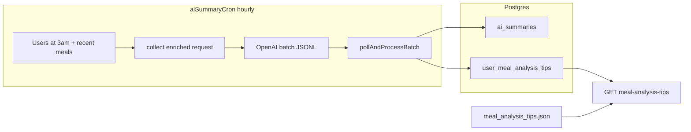

# Personalized meal tips (cron + API merge)

## Baseline (from [i18n_offline_meal_tips_52626a00.plan.md](file:///Users/ashutosh/.cursor/plans/i18n_offline_meal_tips_52626a00.plan.md) and current code)

- **Generic tips:** Loaded from [`backend/src/services/mealAnalysisTips.ts`](backend/src/services/mealAnalysisTips.ts) / [`backend/data/meal_analysis_tips.json`](backend/data/meal_analysis_tips.json); exposed as **`GET /api/v1/food/meal-analysis-tips`** in [`backend/src/routes/v1/food.ts`](backend/src/routes/v1/food.ts) (authenticated, locale from request).
- **Client today:** [`app/lib/core/repositories/food_repository.dart`](app/lib/core/repositories/food_repository.dart) `getMealAnalysisTips()`; **only consumer** is [`app/lib/features/home/widgets/bottom_sheet/meal_analysis_sheet.dart`](app/lib/features/home/widgets/bottom_sheet/meal_analysis_sheet.dart) (5s rotating tips during V2 analysis). Offline list + i18n work is tracked separately in that plan.
- **AI summary cron:** [`backend/src/jobs/aiSummaryCron.ts`](backend/src/jobs/aiSummaryCron.ts) runs hourly: polls OpenAI batches, then selects users at **3am local** with **`meal_analysis_session` rows in the last 3 days** (same window as summaries). [`collectMealDataForUser`](backend/src/services/aiSummaryService.ts) currently builds a **CSV** (date, meal type, name, calories) and the model returns **`{"summary": "..."}`** only; results are inserted via [`saveAiSummary`](backend/src/services/aiSummaryService.ts) into **`ai_summaries`**.
- **Richer meal data already on server:** [`computeAiSummaryStats`](backend/src/routes/v1/food.ts) uses **protein/carbs/fat/fiber** from recent logged meals for the **`GET /api/v1/food/ai-summary`** response—same source can feed the tip prompt.

## Target behavior

1. **Generation:** When the cron builds a batch user request, enrich the model input with **structured context** (not only CSV): `weight_goal`, `daily_calorie_goal`, `activity_level`, optional delta **current vs target weight**, plus **computed signals** from `meal_analysis_session` (e.g. distinct log days in last 7d, streak proxy, average calories vs goal if goal present, macro balance heuristic similar to `macroBalanceScore`, top recurring foods).
2. **Model output:** Extend the JSON schema to something like `{"summary": "...", "mealAnalysisTips": ["...", "..."]}` where **`mealAnalysisTips` are 3–6 short one-liners** suitable for the loading rotator (actionable, non-judgmental, same tone as the existing system prompt). Reuse **`{locale}`** language rule.
3. **Gating / fallback:**
   - If **profile or logs are too thin** (define thresholds, e.g. no `weight_goal` and `< N` logged meals in window, or missing calorie goal when needed), **omit `mealAnalysisTips`** or leave empty; **do not fail** the batch line.
   - **API:** `GET /meal-analysis-tips` loads **generic** tips via `getMealAnalysisTipsForLocale(locale)` as today, then **prepends or interleaves** stored personalized tips **when present and fresh** (same generation window as summary, e.g. last 3 days). If personalized list is empty → **generic-only** (and app offline tips still apply when the request fails, per existing client behavior).

## Storage (chosen: Option B)

**Dedicated table** so tips can evolve on their own (TTL, recompute without touching summaries, future endpoints) while the batch job still generates summary + tips in one model call.

- **Table:** `user_meal_analysis_tips` with at minimum:
  - `id BIGSERIAL PRIMARY KEY`
  - `user_id VARCHAR(255) NOT NULL`
  - `tips JSONB NOT NULL` — array of strings (same shape as API list items)
  - `locale VARCHAR(16) NOT NULL DEFAULT 'en'`
  - `meal_count INTEGER NOT NULL DEFAULT 0` (meals in the window used for generation; mirrors batch meta)
  - `generated_at TIMESTAMPTZ NOT NULL DEFAULT CURRENT_TIMESTAMP`
- **Index:** `CREATE INDEX ... ON user_meal_analysis_tips (user_id, generated_at DESC)` so **`GET /meal-analysis-tips`** can load **`LIMIT 1`** latest row per user efficiently.
- **Writes:** On each successful batch line, **`INSERT` a new row** when `mealAnalysisTips` is non-empty after sanitization; **`ai_summaries`** continues to receive only the narrative **`summary`** via existing `saveAiSummary` (no schema change to `ai_summaries`).
- **Reads:** Latest tips row **must align with freshness rules** (e.g. discard if older than the same window as cron eligibility, or tie-break with `ai_summaries.generated_at` if you need strict coupling—optional).

**Rejected for this project:** Option A (columns on `ai_summaries`) — avoids mixing concerns and keeps summary history free of large tip arrays if summaries are ever exported or retained differently.

## Service changes (concrete files)

| Area | File | Change |
|------|------|--------|
| Context assembly | [`aiSummaryService.ts`](backend/src/services/aiSummaryService.ts) | Extend `UserSummaryRequest` with optional `profileContext` / `statsContext` string or structured fields; add DB reads: **`user_profile`** join by `user_id`, optional aggregate SQL for log consistency over 7–14 days. Enrich CSV to include **macros** (mirror [`buildMealHistoryCsv`](backend/src/routes/v1/food.ts)) for the prompt. |
| Prompt + parse | `aiSummaryService.ts` | Update `SYSTEM_PROMPT_TEMPLATE` and user message; parse `mealAnalysisTips` array in [`pollAndProcessBatch`](backend/src/services/aiSummaryService.ts); validate length and sanitize strings. |
| Persistence | New migration + `aiSummaryService.ts` | Add **`user_meal_analysis_tips`**; add **`saveUserMealAnalysisTips(...)`** (or equivalent) called from **`pollAndProcessBatch`** when tips present; leave **`saveAiSummary`** as-is. |
| API merge | [`food.ts`](backend/src/routes/v1/food.ts) | In `GET /meal-analysis-tips`, after auth: `SELECT` latest personalized tips for `userId` (if any), merge with `getMealAnalysisTipsForLocale`, dedupe by normalized text, cap list length (e.g. max 12). |
| Tests | [`aiSummaryService.test.ts`](backend/src/services/aiSummaryService.test.ts), [`food.test.ts`](backend/src/routes/v1/food.test.ts) | Parsing with/without tips; merge ordering; empty personalized → generic only. |

**Operational note:** Batches already in flight use the old JSON shape—parser must **tolerate missing `mealAnalysisTips`**.

## Where tips can and should be shown

| Place | Should? | Notes |
|-------|---------|-------|
| **[`meal_analysis_sheet.dart`](app/lib/features/home/widgets/bottom_sheet/meal_analysis_sheet.dart)** (V2 analysis loading) | **Yes (primary)** | Already wired; once API returns merged list, **no client change required** beyond optional handling of **`version`** or telemetry. |
| **[`ai_summary_card.dart`](app/lib/features/home/widgets/ai_summary_card.dart)** | **Optional** | Good for **one tip chip** or “This week’s focus” line derived from the **same stored tips** or from **`GET /ai-summary`** expansion—keeps home personalized without another round-trip (could add `tips` to ai-summary response later). |
| **Onboarding / profile** | **Optional** | Short copy explaining that tips personalize as you log; not required for MVP. |
| **`meal_tip_sheet` / post-log flows** | **Cautious** | [`meal_tip_sheet.dart`](app/lib/features/home/widgets/bottom_sheet/meal_tip_sheet.dart) is **meal-specific**; avoid noisy generic rotators there unless the tip is **about logging quality** only. |
| **Push / email** | **Future** | Same store could feed notifications; out of scope unless requested. |

## Non-goals / constraints

- **i18n:** Personalized strings are **model-generated in `locale`**; generic file + app offline strings remain the **translation** path for non-AI tips.
- **Cost:** Same batch line as today—slightly **larger prompt + output**; monitor `max_completion_tokens` (currently 200 in [`buildBatchJsonl`](backend/src/services/aiSummaryService.ts)).
