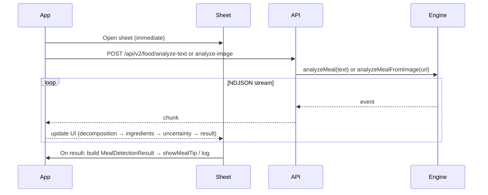

# V2 Food Detection API, Streaming UX, and Dual-Database Grounding

## Current state

- **Backend V2**: Only [backend/src/routes/v2/food.ts](backend/src/routes/v2/food.ts) exposes `POST /api/v2/food/analyze-text`, which streams NDJSON from [backend/src/services/nutritionEngine.ts](backend/src/services/nutritionEngine.ts) (`analyzeMeal(text)`). No V2 image endpoint exists; the nutrition engine is text-only (LLM decomposition → DB/alias lookup → macros → uncertainty → result).
- **App**: [app/lib/core/repositories/food_repository.dart](app/lib/core/repositories/food_repository.dart) calls V1 only (`/api/v1/food/detect-text`, `/api/v1/food/detect-image`). [meal_description.dart](app/lib/features/home/widgets/meal_description.dart) and [meal_snap.dart](app/lib/features/home/widgets/meal_snap.dart) wait for the full response, then show variation sheet or [meal_tip_sheet.dart](app/lib/features/home/widgets/bottom_sheet/meal_tip_sheet.dart). No streaming or in-progress UI.
- **Food DB**: [backend/src/scripts/usda-foods-sample.json](backend/src/scripts/usda-foods-sample.json) is a **single merged file** with both `"source": "USDA"` and `"source": "IFCT"` entries (e.g. paneer, toor dal, moong dal from IFCT). The nutrition engine loads this once and matches against the combined index; it does not choose “American vs Indian” — it uses both in one lookup.

## 1. Grounding with American and Indian databases — you can do both together

The pipeline already grounds against **one merged database** that contains both USDA (American) and IFCT (Indian) entries. There is no separate “American API” and “India API”; a single lookup can resolve “roti” to a USDA/whole-wheat entry and “toor dal” to an IFCT entry in the same meal.

- **Today**: `usda-foods-sample.json` already has USDA + IFCT; [nutritionEngine.ts](backend/src/services/nutritionEngine.ts) uses it as one `FOOD_DB` / `foodIndex`. No code change required to “use both”; just ensure the deployed JSON (or future DB) includes both datasets.
- **Optional enhancement**: Expose which database each ingredient came from (e.g. `database_source: 'USDA' | 'IFCT'`) in the streamed payloads so the app can show “Calories from USDA / IFCT” or badge per ingredient. This would require adding the food’s `source` from `FoodEntry` into `ResolvedIngredientDTO` when `source === 'db'`.

So: **Yes, you can ground with both American and Indian databases together** — they live in one merged store and the engine matches against it in a single pass.

---

## 2. Backend: Complete V2 API (text + image, streaming)

**Text**  

- Already implemented: `POST /api/v2/food/analyze-text` streams NDJSON. No change needed unless you add `database_source` as above.

**Image**  

- Add `POST /api/v2/food/analyze-image` that also streams the same NDJSON event types.
- **Design**: Keep the nutrition engine text-based. For image:
  1. Accept either **image URL** (same as V1: app uploads to Oracle, sends URL) or **multipart file** (optional, for parity with V1 analyze-image).
  2. **Vision step**: Use a vision-capable LLM (e.g. same model as decomposition with image input) to produce the **same decomposition structure** as text: `meal_name`, `ingredients[]` with `raw_name`, `canonical_hint`, `grams_estimated`, `min_grams`, `max_grams`, `notes`, `confidence`. No calories in this step.
  3. **Reuse pipeline**: Once you have that decomposition, call the same resolution/macros/uncertainty/result logic (either refactor `analyzeMeal` to accept a precomputed `LLMDecomposition` or add `analyzeMealFromDecomposition(decomposition)` that yields from “ingredients” onward). Stream: `decomposition` → `ingredients` → `uncertainty` → `result`.

**Files to add/change**

- [backend/src/routes/v2/food.ts](backend/src/routes/v2/food.ts): Add `POST /analyze-image` (body: `imageUrl` or multipart). Validate URL or buffer, then run image pipeline and stream NDJSON (same headers as analyze-text).
- [backend/src/services/nutritionEngine.ts](backend/src/services/nutritionEngine.ts):
  - Add `decomposeFromImage(client, imageUrlOrBuffer, mimeType?)` returning `Promise<LLMDecomposition>` (vision API call with the same JSON schema as text decomposition).
  - Add `analyzeMealFromDecomposition(client, decomposition): AsyncGenerator<PipelineEvent>` that yields from `ingredients` through `result` (no first `decomposition` yield if you prefer, or yield it from the image path for consistency).
  - Export `analyzeMealFromImage(imageUrl: string)` (and optionally an overload for buffer) that: gets client → calls `decomposeFromImage` → yields `{ step: 'decomposition', data: ... }` → then runs `analyzeMealFromDecomposition` for the rest.
- Reuse existing config (e.g. `OPENAI_API_KEY`); vision model can be the same as text decomposition model if it supports images.

**Optional**: Add `database_source` to `ResolvedIngredientDTO` (and to the generator) when the match is from DB, by reading `FoodEntry.source` from `foodIndex`.

---

## 3. App: Integrate V2 and show streaming in a bottom sheet

**3.1 Streaming HTTP client**

- The app currently uses [Dio](app/lib/core/network/network_client.dart) with JSON request/response only. For NDJSON streaming you need a **streamed response**.
- Options:
  - **Dio**: `responseType: ResponseType.stream`, then read `response.data` as `ResponseBody` and parse line-by-line (split by `\n`, parse each line as JSON). Add a method on `NetworkClient` or a dedicated service, e.g. `Stream<PipelineEvent> analyzeTextV2(String text)` and `analyzeImageV2(String imageUrl)` that POST to `/api/v2/food/analyze-text` or `/api/v2/food/analyze-image` and return a stream of parsed events.
  - Or use `HttpClient` directly for these two endpoints to avoid Dio stream quirks; still use the same base URL and auth (copy headers from Dio interceptors or a shared helper).
- Handle: connection errors, non-2xx, and `step: 'error'` in the stream (forward as stream error or a terminal event).

**3.2 V2 repository / service**

- In [app/lib/core/repositories/food_repository.dart](app/lib/core/repositories/food_repository.dart) (or a new `FoodRepositoryV2` / streaming service), add:
  - `Stream<Map<String, dynamic>> analyzeTextStream(String textDescription)` → POST to `/api/v2/food/analyze-text`, return stream of parsed NDJSON objects.
  - `Stream<Map<String, dynamic>> analyzeImageStream(String imageUrl)` → POST to `/api/v2/food/analyze-image` with `imageUrl`, return stream of parsed NDJSON objects. (If you add multipart later, add an overload with `File`.)
- Define a small DTO or typed model for pipeline events (e.g. `step`, `data`) so the UI can switch on `step`: `decomposition`, `ingredients`, `uncertainty`, `result`, `error`.

**3.3 New streaming bottom sheet**

- **Flow**: When the user triggers “Analyze” (text or image), **open a bottom sheet immediately** (no full-screen loading). The sheet shows:
  - Initial state: “Analyzing…” / skeleton.
  - On `decomposition`: show meal name and ingredient list (raw names + grams).
  - On `ingredients`: show resolved ingredients (canonical names, macros per ingredient, optional `database_source`).
  - On `uncertainty`: show calorie band (min–max), “needs clarification” if true, and clarification options if any.
  - On `result`: show final meal name, total macros, calorie confidence, and actions (e.g. “Log meal”, which then calls existing `showMealTip` or navigates to log).
  - On `error`: show error message and retry/dismiss.
- **Mapping to existing UI**: When the stream completes with `result`, build a `MealDetectionResult` (and `Meal` with `name`, `macros`, etc.) from the last event’s `data` so you can call the existing `showMealTip(context, mealDetectionResult: ...)` for the “Log meal” flow, or embed the same summary in the streaming sheet and keep one “Confirm & log” that uses the same logging path as today.
- **Where to hook**: From [meal_description.dart](app/lib/features/home/widgets/meal_description.dart) (text) and [meal_snap.dart](app/lib/features/home/widgets/meal_snap.dart) (image), instead of calling V1 and waiting:
  - Call the new V2 streaming API.
  - Open the new bottom sheet with the stream.
  - On completion, pass the built `MealDetectionResult` into the existing tip/variation flow if you still want variation sheet when applicable; or simplify to “streaming sheet → result → showMealTip” only (variations can be revisited if V2 adds them later).

**3.4 UX details**

- **Text path**: User taps “Analyze” → bottom sheet opens → stream runs → UI updates step by step → final “Log meal” / “Show tip” using existing `showMealTip`.
- **Image path**: After upload (same as today), instead of waiting for V1 response, call V2 analyze-image with the image URL → same streaming sheet. Optionally show a thumbnail in the sheet.
- Ensure timeouts and errors (network, `step: 'error'`) close or update the sheet with a clear message and retry option.

---

## 4. Summary diagram

---

## 5. Implementation order

1. **Backend**: Add `decomposeFromImage` and `analyzeMealFromDecomposition` (and optionally `analyzeMealFromImage`) in [nutritionEngine.ts](backend/src/services/nutritionEngine.ts); add `POST /api/v2/food/analyze-image` in [v2/food.ts](backend/src/routes/v2/food.ts). Optionally add `database_source` to streamed payloads.
2. **App**: Add streaming HTTP support and V2 repository methods for analyze-text and analyze-image.
3. **App**: Implement the streaming bottom sheet and wire it from the text and image flows; map final `result` event to `MealDetectionResult` and integrate with `showMealTip` / logging.
4. **Optional**: Enrich food DB with more IFCT/USDA entries and expose `database_source` in the UI (e.g. “Source: USDA” / “IFCT” per ingredient).

This keeps V1 intact until you are ready to deprecate it; the new flow is “use V2 + streaming sheet” for both text and image.