# Calorify

Calorify is a friendly nutrition tracker for Android and Wear OS. Log a meal by typing or photographing it, get a helpful calorie and macro estimate, and keep your progress close at hand—even when you’re offline.

> Calorie estimates are for information only and aren’t medical advice.

## Highlights

- AI-assisted meal logging from text or photos
- Nutrition estimates grounded in USDA food data
- Clarifying questions when portions are uncertain
- Goals, history, favorites, and Health Connect support
- A Wear OS companion for quick voice logging

## App flow and feature map

```mermaid
%%{init: {"flowchart": {"defaultRenderer": "elk", "nodeSpacing": 30, "rankSpacing": 50}}}%%
flowchart TB
  USER([User])

  subgraph PHONE["Android phone app · Flutter"]
    direction TB

    subgraph STARTUP["Startup and onboarding"]
      direction LR
      LAUNCH["Launch app"] --> SPLASH["Splash and initialization"]
      SPLASH --> INIT["Load language and local database<br/>restore Firebase guest session<br/>initialize Health Connect, notifications,<br/>analytics, crash reporting, and Wear OS"]
      INIT --> GUARD{"Onboarding complete?"}
      GUARD -->|No| ONBOARD["13-step onboarding<br/>welcome → weight goal → activity → motivation<br/>→ gender → height → current weight → health context<br/>→ target weight → age → tracking guidance<br/>→ Health Connect → meal reminders"]
      ONBOARD --> PROFILE_SAVE["Save profile, units, goal,<br/>permissions, and reminder choices"]
      PROFILE_SAVE --> MAIN
      GUARD -->|Yes| MAIN["Responsive main shell<br/>phone dock or tablet navigation rail"]
    end

    subgraph PRIMARY["Primary navigation"]
      direction LR
      MAIN --> DASH["Dashboard"]
      MAIN --> LOG["Log meal"]
      MAIN --> HISTORY["History"]
      MAIN --> MENU["App menu"]

      DASH --> DASH_FEATURES["Daily calorie goal and progress<br/>calories burned · macro split<br/>7-day intake chart · today's meals<br/>Health Connect setup/status"]
      HISTORY --> HISTORY_FEATURES["Paginated meal timeline<br/>grouped by day · open details<br/>edit or delete logged meals"]
      MENU --> PROFILE["Profile<br/>personal metrics · goals and activity<br/>BMI/BMR/TDEE-derived values · edit profile"]
      MENU --> SETTINGS["Settings"]
    end

    subgraph CAPTURE["Meal capture and analysis"]
      direction TB
      LOG --> INPUT{"Choose an input"}
      INPUT -->|Camera or gallery| PHOTO["Compress photo on device"]
      PHOTO --> UPLOAD["Upload to private object storage"]
      UPLOAD --> IMAGE_API["Start streamed image analysis"]

      INPUT -->|Typed description| TEXT_ROUTE{"Local analysis enabled<br/>and device/model ready?"}
      TEXT_ROUTE -->|Yes| LOCAL_MODEL["On-device interpretation<br/>build an ingredient proposal"]
      LOCAL_MODEL --> REVIEW["Review and edit ingredients,<br/>portions, preparation, and ranges"]
      REVIEW --> LOCAL_NUTRITION{"Offline nutrition pack<br/>can resolve ingredients?"}
      LOCAL_NUTRITION -->|Yes| LOCAL_RESULT["Calculate nutrition locally"]
      LOCAL_NUTRITION -->|No| CLOUD_PROPOSAL["Send approved proposal for<br/>server-side nutrition resolution"]
      TEXT_ROUTE -->|No or local fallback| TEXT_API["Start streamed cloud text analysis"]

      INPUT -->|Favorite or custom meal| QUICK["Review/edit saved nutrition<br/>and choose meal type"]
      QUICK --> SAVE

      IMAGE_API --> PIPELINE
      TEXT_API --> PIPELINE
      CLOUD_PROPOSAL --> PIPELINE
      LOCAL_RESULT --> PIPELINE["Live analysis progress<br/>detect food → interpret dish → decompose ingredients<br/>→ estimate portions → ground nutrition → summarize"]
      PIPELINE --> FOOD{"Food detected?"}
      FOOD -->|No| RETRY["Explain no-food result<br/>retry with another input"]
      RETRY --> INPUT
      FOOD -->|Yes| CLARIFY{"More detail needed?"}
      CLARIFY -->|Yes| QUESTIONS["Answer portion, ingredient,<br/>or preparation questions"]
      QUESTIONS --> PIPELINE
      CLARIFY -->|No| TYPE{"Meal type known?"}
      TYPE -->|No| PICK_TYPE["Choose breakfast, lunch,<br/>dinner, or snack"]
      PICK_TYPE --> PIPELINE
      TYPE -->|Yes| RESULT["Meal result<br/>calories · protein · carbs · fat · fiber<br/>health score/reason · ingredient breakdown · tip"]
      RESULT -->|Adjust input| REANALYZE["Reanalyze with a correction"]
      REANALYZE --> PIPELINE
      RESULT -->|Rate result| FEEDBACK["Helpful / not helpful<br/>issue tags and optional note"]
      RESULT -->|Confirm| SAVE["Save the logged meal locally"]
    end

    subgraph LIBRARY["Meal library and daily management"]
      direction LR
      SAVE --> TODAY["Dashboard and today's totals refresh"]
      SAVE --> HISTORY
      TODAY --> DETAILS["Meal details"]
      HISTORY_FEATURES --> DETAILS
      DETAILS --> EDIT["Edit name, type, time,<br/>nutrition, score, and image"]
      DETAILS --> DELETE["Delete meal"]
      DETAILS --> FAVORITE["Add/remove favorite"]
      FAVORITE --> FAVORITES["Favorites library<br/>search · sort · quick log<br/>edit · remove · undo"]
      FAVORITES --> QUICK
      EDIT --> SAVE
    end

    subgraph PREFERENCES["Settings and supporting flows"]
      direction TB
      SETTINGS --> PERSONALIZE["Language · light/dark/system theme<br/>metric/imperial height and weight units"]
      SETTINGS --> REMINDERS["Meal reminder schedule<br/>local notification permissions"]
      SETTINGS --> HEALTH_SETTINGS["Health Connect permissions<br/>read activity/calories · opt-in nutrition export<br/>disconnect or delete app-written health records"]
      SETTINGS --> LOCAL_SETTINGS["Beta on-device inference<br/>install/update/clear offline USDA nutrition pack"]
      SETTINGS --> SUPPORT["Send feedback email · export meal history CSV<br/>About/legal · app version"]
      SETTINGS --> PRIVACY["Clear all local app data"]
      SETTINGS --> DEV["Debug builds: database inspector,<br/>analysis observability, local inference,<br/>mock states and diagnostics"]
    end

    subgraph LOCAL_DATA["Offline-first phone data"]
      direction LR
      DB[("Drift / SQLite<br/>profile · preferences · meals · favorites<br/>local nutrition cache · durable sync queues")]
      OUTBOX["Transactional outboxes<br/>meal-log confirmations/deletions<br/>and Health Connect upserts/deletions"]
      PACK[("Versioned local<br/>nutrition pack")]
    end

    PROFILE_SAVE --> DB
    PERSONALIZE --> DB
    REMINDERS --> DB
    FAVORITES --> DB
    SAVE --> DB
    EDIT --> DB
    DELETE --> DB
    DB --> OUTBOX
    LOCAL_SETTINGS --> PACK
    PACK --> LOCAL_NUTRITION
  end

  subgraph WATCH["Wear OS companion · Flutter"]
    direction TB
    W_START["Launch watch app"] --> W_CACHE["Restore cached meals,<br/>favorites, goal, and pending operations"]
    W_CACHE --> W_HOME["Watch dashboard<br/>connection/sync state · calorie progress<br/>macro glance · today's recent meals"]
    W_HOME --> W_ACTION{"Choose action"}
    W_ACTION -->|Voice log| VOICE["Microphone permission → live transcript<br/>confirm speech → analyze through phone"]
    W_ACTION -->|Favorites| W_FAV["Browse cached favorites<br/>and quick log"]
    W_ACTION -->|History| W_HISTORY["Browse cached meal history"]
    W_ACTION -->|Delete| W_DELETE["Optimistic meal deletion"]
    VOICE --> W_RESULT["Review calories/macros<br/>confirm meal"]
    W_RESULT --> W_MUTATION["Log meal"]
    W_FAV --> W_MUTATION
    W_DELETE --> W_MUTATION
    W_MUTATION --> CONNECTED{"Paired phone connected?"}
    CONNECTED -->|Yes| DATA_LAYER["Correlated JSON request<br/>over Wear OS Data Layer"]
    CONNECTED -->|No| W_QUEUE[("Watch SQLite cache<br/>durable log/delete queue")]
    W_QUEUE -->|30-second retry or reconnect| DATA_LAYER
    DATA_LAYER --> PHONE_BRIDGE["Phone Wear OS service<br/>today's meals · calorie goal · favorites<br/>analyze text · log/delete meal"]
    PHONE_BRIDGE --> DB
    DB -->|Fresh dashboard snapshot| DATA_LAYER
    DATA_LAYER --> W_CACHE
  end

  subgraph BACKEND["Authenticated backend · Fastify / Node.js"]
    direction TB
    API["Firebase ID-token authentication<br/>App Check context · validation · rate limits"]
    API --> V2["Streamed meal API v2<br/>text/image/proposal · clarify · meal type<br/>resume · reanalyze · feedback · confirm log"]
    API --> V1["Supporting API v1<br/>profile · meal-analysis tips<br/>meal-history CSV export · AI summary"]
    V2 --> ENGINE["Nutrition engine<br/>dish interpretation and decomposition<br/>quantity/portion estimation · deterministic rules"]
    ENGINE --> USDA_LOOKUP["USDA lookup and nutrient calculation<br/>with bounded model fallback"]
    ENGINE --> SESSION[("PostgreSQL<br/>analysis sessions · snapshots · confirmed logs<br/>profiles · feedback · summary state")]
    V1 --> SESSION
    SUMMARY_JOB["Hourly job<br/>process users near local 03:00<br/>batch nutritional summaries"] --> SESSION
    OPS["Health/readiness endpoints<br/>structured logs · Prometheus metrics<br/>analysis and provider observability"] --> API
  end

  subgraph EXTERNAL["Platform and external services"]
    direction LR
    FIREBASE["Firebase<br/>anonymous/Google auth · App Check<br/>Crashlytics · Analytics · FCM · app banners"]
    OBJECTS[("Oracle Object Storage<br/>meal photos and nutrition-pack artifact")]
    MODELS["OpenRouter / OpenAI<br/>meal interpretation and summaries"]
    USDA[("USDA FoodData Central<br/>imported nutrition dataset")]
    HEALTH["Android Health Connect<br/>active calories and nutrition records"]
    NOTIFY["Android notifications<br/>meal reminders and app messages"]
  end

  USER --> LAUNCH
  USER --> W_START
  SPLASH --> FIREBASE
  API --> FIREBASE
  UPLOAD --> OBJECTS
  IMAGE_API --> API
  TEXT_API --> API
  CLOUD_PROPOSAL --> API
  QUESTIONS --> API
  PICK_TYPE --> API
  REANALYZE --> API
  FEEDBACK --> API
  OUTBOX -->|Retry on startup, resume, and mutation| API
  OUTBOX -->|When nutrition sync is enabled| HEALTH
  HEALTH -->|Active calories and authorization state| DASH_FEATURES
  HEALTH_SETTINGS --> HEALTH
  REMINDERS --> NOTIFY
  FIREBASE --> NOTIFY
  ENGINE --> MODELS
  SUMMARY_JOB --> MODELS
  USDA --> USDA_LOOKUP
  OBJECTS --> ENGINE
  OBJECTS --> PACK
  PROFILE_SAVE -->|Profile sync| V1
  SUPPORT -->|CSV export| V1

  SHARED["Shared packages across phone and watch<br/>protobuf models · localization · themes/specs<br/>widgets · utilities · services"]
  SHARED -.-> INIT
  SHARED -.-> W_CACHE
```



## Project layout

- `app/` — Flutter phone app
- `watch_app/` — Wear OS companion app
- `backend/` — API and nutrition services
- `shared_packages/` — shared app code and design resources

## Get started

You’ll need Flutter, Node.js, and Docker installed locally.

```bash
git clone <repository-url>
cd calorify

cd app && flutter pub get
cd ../watch_app && flutter pub get
cd ../backend && npm ci
cp env.example .env
```

Add your local backend settings to `backend/.env`, then follow the setup notes in [backend/README.md](backend/README.md). Run either app from its directory with `flutter run`.

## Learn more

- [Documentation index](docs/README.md)
- [Backend setup and development](backend/README.md)
- [Backend deployment and operations](backend/DEPLOYMENT.md)
- [Security guidance](SECURITY.md)

## Contributing

Bug fixes, thoughtful improvements, and feedback are welcome. Please keep credentials out of source control and add coverage for behavior changes.
