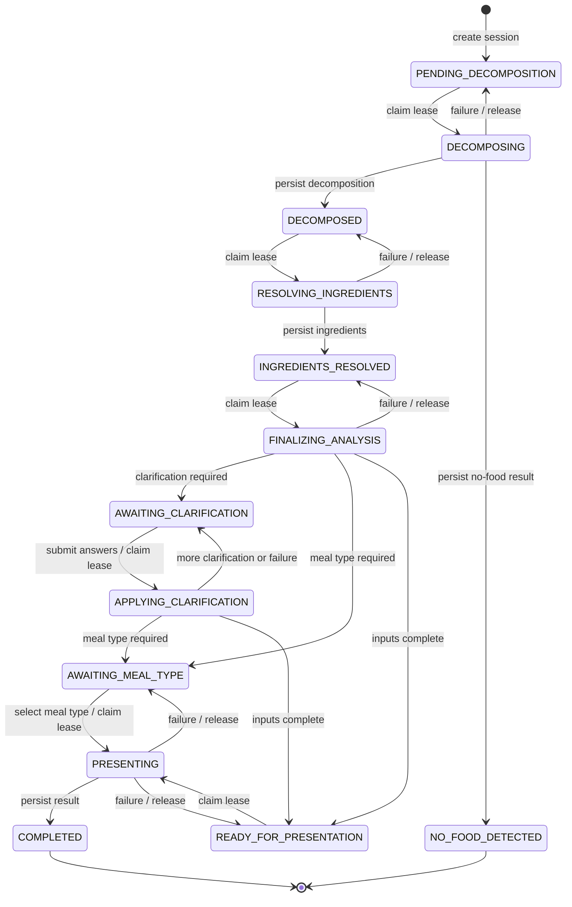

# Meal-analysis state machine

This document describes the durable V2 meal-analysis session state machine.
The source of truth is the `stage` column on `meal_analysis_session`; streamed
pipeline steps are client notifications, not states.

The implementation is shared by text, image, and accepted local-proposal
analysis. All paths use the same durable checkpoints and resume behavior.

## End-to-end flow

1. The application creates a client-stable analysis UUID and captures locale,
   country, time zone, and local date-time context. The backend persists the
   request and context before model or nutrition work starts; resume reuses the
   captured values.
2. Text and image inputs produce the same strict V2 decomposition core. Every
   candidate is classified as food or non-food with evidence and confidence.
   Food candidates also contain a localized display name, an ordered USDA
   lookup proposal, preparation states, and a bounded portion estimate.
3. The backend validates the complete generated output before branching.
   Non-food candidates are then discarded. A valid `NO_FOOD` outcome is stored
   as `NO_FOOD_DETECTED` and emitted as the terminal `NO_FOOD` event without
   USDA lookup, clarification, presentation, or meal logging.
4. A food decomposition is persisted before resolution. USDA lookup evaluates
   the proposed canonical identity and every alias, applies preparation-aware
   ranking, and calculates nutrition deterministically where a suitable row is
   available. Existing fallback behavior handles unresolved nutrition.
5. The calculated ingredient snapshot drives uncertainty. The pipeline either
   waits for stable-ID clarification answers, waits for a stable meal-type enum,
   or proceeds directly to presentation. Submitted answers update the durable
   calculated snapshot without repeating decomposition or USDA resolution.
6. Presentation is text-only. It receives the persisted meal name, calculated
   meal data, locale context, and normalized optional profile context. It may
   produce quantity, tip, and health copy, but cannot replace the meal name or
   expose the supplied profile context.
7. The final food result is persisted as `COMPLETED` before `RESULT` is emitted.
   Flutter renders clarification and meal-type copy from semantic wire values,
   and routes `NO_FOOD` through the existing unidentified-meal tip sheet.

Accepted on-device proposals use the same V2 semantic core and validation
boundary. On-device work after that validated output remains governed by the
separate local-inference plan; this robustness change does not introduce a
second state machine.

## Contract and persistence boundaries

| Boundary | Durable or client-visible data | Deliberately excluded |
| --- | --- | --- |
| Generated decomposition | Outcome evidence, localized food names, lookup proposals, preparation states, portions, inferred meal type | Application IDs, schema constants, nutrition values |
| Durable decomposition | Food items and backend lookup proposals needed for resolution/resume | Transient non-food candidate details |
| Durable resolved ingredients | Display names, portion data, calculated macro bands, nutrition source, optional meal-level USDA dataset version | Row-level FDC IDs, matched descriptions, scores, candidate rows, per-100-g references |
| Clarification and meal-type wire | Stable IDs/enums and numeric option data | Backend-generated questions, labels, and translated answer text |
| Public result | Display names, portions, macros, confidence, presentation copy, provenance receipt | Canonical lookup hints, USDA match identity, profile context |
| Logs and audit rows | Analysis IDs, stages, aggregate counts, stable submitted IDs | Meal text, transient candidates, profile context, USDA row metadata |

The backend schema is canonical for cloud generated output, protobuf is
canonical for cross-language transport, and ML Kit annotations define the
on-device generated-output boundary. Application code injects proposal IDs,
row IDs, and schema versions only after model-output validation.

## State diagram

`COMPLETED` and `NO_FOOD_DETECTED` are successful terminal states. There is
deliberately no durable `ERROR` state: a failed attempt leaves the last valid
checkpoint so the same analysis can be resumed safely.

## State definitions

| State | Kind | Meaning and required durable data |
| --- | --- | --- |
| `PENDING_DECOMPOSITION` | Checkpoint | The analysis ID, owner, source, request, and context exist before external work starts. |
| `DECOMPOSING` | Leased | One worker owns decomposition. No decomposition output may exist yet. |
| `NO_FOOD_DETECTED` | Terminal | `result_data` contains the typed no-food outcome, reason, confidence, and analysis ID. No candidate items are retained. |
| `DECOMPOSED` | Checkpoint | `decomposition_data` is valid and resumable. |
| `RESOLVING_INGREDIENTS` | Leased | One worker owns deterministic/USDA/fallback ingredient resolution. |
| `INGREDIENTS_RESOLVED` | Checkpoint | Valid `decomposition_data` and `ingredients_data` exist. |
| `FINALIZING_ANALYSIS` | Leased | One worker owns uncertainty calculation and routing to the next user or presentation state. |
| `AWAITING_CLARIFICATION` | Waiting | Uncertainty and at least one clarification are persisted. The server waits for answers. |
| `APPLYING_CLARIFICATION` | Leased | One worker owns the submitted answers. `pending_clarification_answers` preserves them across worker failure. |
| `AWAITING_MEAL_TYPE` | Waiting | Clarification is complete, but a concrete meal type is still required. The question is persisted. |
| `READY_FOR_PRESENTATION` | Checkpoint | Ingredients, uncertainty, and a concrete selected meal type are durable. |
| `PRESENTING` | Leased | One worker owns presentation enrichment and final-result construction. |
| `COMPLETED` | Terminal | `result_data` and all data needed to replay the `RESULT` event are durable. |

The validation rules live in
[`mealAnalysisStage.ts`](../src/services/mealAnalysisStage.ts). A row with an
impossible combination of stage and payload is rejected as an invalid snapshot
instead of being guessed forward.

## Leases and fencing

The five active-work states are leased:

- `DECOMPOSING`
- `RESOLVING_INGREDIENTS`
- `FINALIZING_ANALYSIS`
- `APPLYING_CLARIFICATION`
- `PRESENTING`

Claiming work atomically moves the row from its expected checkpoint to the
active state and assigns a random UUID in `stage_lease_token`. A successful
write must match all of:

1. the analysis ID;
2. the active stage; and
3. the lease token.

The write then stores the next checkpoint and clears the token. This fencing
prevents a duplicate or stale worker from overwriting newer state.

If work fails, a token-guarded release returns the row to its preceding
checkpoint. If a worker disappears without releasing, another request may
reclaim the active state after five minutes with a new token. The old worker's
later write is then rejected. Failure of best-effort lease cleanup is logged,
but cannot replace an already persisted result with a trailing error.

The lease SQL and transition guards live in
[`mealAnalysisStore.ts`](../src/services/mealAnalysisStore.ts).

## Durable states versus stream steps

The HTTP response streams NDJSON or SSE pipeline events. Each useful event is
emitted only after the corresponding state is durable.

| Stream step | Durable guarantee when emitted |
| --- | --- |
| `STARTED` | The session exists as `PENDING_DECOMPOSITION` or a resumable later state. |
| `DECOMPOSITION` | The row reached `DECOMPOSED`. |
| `INGREDIENTS` | The row reached `INGREDIENTS_RESOLVED`, or updated clarified ingredients are part of the next persisted checkpoint. |
| `UNCERTAINTY` | The row reached `AWAITING_CLARIFICATION`, `AWAITING_MEAL_TYPE`, or `READY_FOR_PRESENTATION`. |
| `MEAL_TYPE_QUESTION` | The row is `AWAITING_MEAL_TYPE`. |
| `RESULT` | The row is `COMPLETED`; resuming replays this stored result. |
| `NO_FOOD` | The row is `NO_FOOD_DETECTED`; resuming replays the stored no-food result. |
| `ERROR` | Only the current request attempt failed. The row remains at its last durable checkpoint. |

Consequently, a stream such as `STARTED`, `DECOMPOSITION`, `INGREDIENTS`,
`UNCERTAINTY`, `ERROR` does not mean those earlier steps were rolled back. The
client should retain the analysis ID and may call `/resume` when `retryable` is
true.

## Entry points and idempotency

Analysis creation inserts the client-selected UUID before calling an LLM or
nutrition provider. Reusing an ID has two possible outcomes:

- the owner, source, parent, and semantic request match, so processing resumes
  the existing session;
- identity differs, so creation returns a conflict and no work is started.

The V2 food routes then operate on the state machine as follows:

| Route | Allowed behavior |
| --- | --- |
| Text, image, or proposal analysis | Create at `PENDING_DECOMPOSITION`, or resume a matching existing session. |
| `/resume` | Continue automatic work from the last checkpoint, return pending questions, replay `RESULT` for `COMPLETED`, or replay `NO_FOOD`. |
| `/clarify` | Claim `AWAITING_CLARIFICATION`, apply answers, and route to another clarification, meal type, or presentation. |
| `/meal-type` | Claim `AWAITING_MEAL_TYPE` and run presentation using the user-selected type. |
| `/reanalyze` | Create a new child analysis; it does not reopen or mutate the parent state. |
| `/confirm-log` | Update or clear log metadata only when the analysis is `COMPLETED`; it does not change the analysis stage. |

All continuation and confirmation routes require a valid UUID and ownership of
the session. Save, edit, and delete confirmation is retried by the phone's
durable outbox through the same `/confirm-log` route.

Pipeline orchestration is in
[`nutritionEngineV2.ts`](../src/services/nutritionEngineV2.ts), and the HTTP
contract is in [`food.ts`](../src/routes/v2/food.ts).

## Retry and recovery rules

- A busy lease is retryable. The caller should retry `/resume`, not start a new
  analysis ID.
- Unexpected database, provider, or worker failures are retryable because the
  preceding checkpoint is durable.
- Missing sessions, ID conflicts, and invalid snapshots are non-retryable.
- A reconnect at an active leased state either observes it as busy or reclaims
  it after the five-minute stale threshold.
- Resuming `COMPLETED` returns stored `RESULT` data and never reruns presentation.
- Resuming `NO_FOOD_DETECTED` returns stored `NO_FOOD` data and never runs
  ingredient resolution or presentation.
- Legacy rows without an explicit stage are inferred from their last durable
  payload, then handled by the same validation and transition rules.

## Invariants and test coverage

The implementation must preserve these invariants:

1. State never regresses through an unfenced write.
2. An active or completed state cannot be overwritten by a general upsert.
3. A leased write is accepted only from its current token owner.
4. Client-visible progress never promises a checkpoint that has not persisted.
5. Every terminal stage contains its matching replayable result variant.
6. Meal-log confirmation never precedes `COMPLETED`.
7. Audit-row failure never invalidates the canonical session snapshot.

Unit coverage is in
[`mealAnalysisStage.test.ts`](../src/services/mealAnalysisStage.test.ts),
[`mealAnalysisStore.test.ts`](../src/services/mealAnalysisStore.test.ts), and
[`nutritionEngineV2.test.ts`](../src/services/nutritionEngineV2.test.ts). The
`mealAnalysisStore.postgres.test.ts` PostgreSQL contract test runs the real
null-stage migration, placeholder types, automatic and interactive lease
transitions, stale-worker fencing, and completed-only log confirmation against
PostgreSQL when `CALORIFY_POSTGRES_CONTRACT_TEST=true`.
