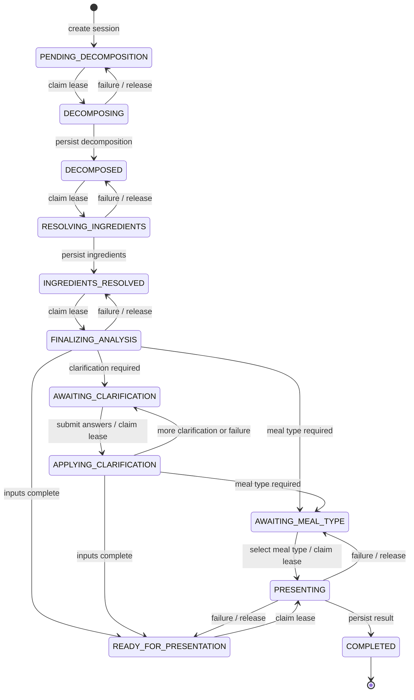

# Meal-analysis state machine

This document describes the durable V2 meal-analysis session state machine.
The source of truth is the `stage` column on `meal_analysis_session`; streamed
pipeline steps are client notifications, not states.

The implementation is shared by text, image, and accepted local-proposal
analysis. All paths use the same durable checkpoints and resume behavior.

## State diagram

`COMPLETED` is the only terminal analysis state. There is deliberately no
durable `ERROR` state: a failed attempt leaves the last valid checkpoint so the
same analysis can be resumed safely.

## State definitions

| State | Kind | Meaning and required durable data |
| --- | --- | --- |
| `PENDING_DECOMPOSITION` | Checkpoint | The analysis ID, owner, source, request, and context exist before external work starts. |
| `DECOMPOSING` | Leased | One worker owns decomposition. No decomposition output may exist yet. |
| `DECOMPOSED` | Checkpoint | `decomposition_data` is valid and resumable. |
| `RESOLVING_INGREDIENTS` | Leased | One worker owns deterministic/USDA/fallback ingredient resolution. |
| `INGREDIENTS_RESOLVED` | Checkpoint | Valid `decomposition_data` and `ingredients_data` exist. |
| `FINALIZING_ANALYSIS` | Leased | One worker owns uncertainty calculation and routing to the next user or presentation state. |
| `AWAITING_CLARIFICATION` | Waiting | Uncertainty and at least one clarification are persisted. The server waits for answers. |
| `APPLYING_CLARIFICATION` | Leased | One worker owns the submitted answers. `pending_clarification_answers` preserves them across worker failure. |
| `AWAITING_MEAL_TYPE` | Waiting | Clarification is complete, but a concrete meal type is still required. The question is persisted. |
| `READY_FOR_PRESENTATION` | Checkpoint | Ingredients, uncertainty, and a concrete selected meal type are durable. |
| `PRESENTING` | Leased | One worker owns presentation enrichment and final-result construction. |
| `COMPLETED` | Terminal | `result_data` and all data needed to replay the `RESULT` event are durable. |

The validation rules live in
[`mealAnalysisStage.ts`](../src/services/mealAnalysisStage.ts). A row with an
impossible combination of stage and payload is rejected as an invalid snapshot
instead of being guessed forward.

## Leases and fencing

The five active-work states are leased:

- `DECOMPOSING`
- `RESOLVING_INGREDIENTS`
- `FINALIZING_ANALYSIS`
- `APPLYING_CLARIFICATION`
- `PRESENTING`

Claiming work atomically moves the row from its expected checkpoint to the
active state and assigns a random UUID in `stage_lease_token`. A successful
write must match all of:

1. the analysis ID;
2. the active stage; and
3. the lease token.

The write then stores the next checkpoint and clears the token. This fencing
prevents a duplicate or stale worker from overwriting newer state.

If work fails, a token-guarded release returns the row to its preceding
checkpoint. If a worker disappears without releasing, another request may
reclaim the active state after five minutes with a new token. The old worker's
later write is then rejected. Failure of best-effort lease cleanup is logged,
but cannot replace an already persisted result with a trailing error.

The lease SQL and transition guards live in
[`mealAnalysisStore.ts`](../src/services/mealAnalysisStore.ts).

## Durable states versus stream steps

The HTTP response streams NDJSON or SSE pipeline events. Each useful event is
emitted only after the corresponding state is durable.

| Stream step | Durable guarantee when emitted |
| --- | --- |
| `STARTED` | The session exists as `PENDING_DECOMPOSITION` or a resumable later state. |
| `DECOMPOSITION` | The row reached `DECOMPOSED`. |
| `INGREDIENTS` | The row reached `INGREDIENTS_RESOLVED`, or updated clarified ingredients are part of the next persisted checkpoint. |
| `UNCERTAINTY` | The row reached `AWAITING_CLARIFICATION`, `AWAITING_MEAL_TYPE`, or `READY_FOR_PRESENTATION`. |
| `MEAL_TYPE_QUESTION` | The row is `AWAITING_MEAL_TYPE`. |
| `RESULT` | The row is `COMPLETED`; resuming replays this stored result. |
| `ERROR` | Only the current request attempt failed. The row remains at its last durable checkpoint. |

Consequently, a stream such as `STARTED`, `DECOMPOSITION`, `INGREDIENTS`,
`UNCERTAINTY`, `ERROR` does not mean those earlier steps were rolled back. The
client should retain the analysis ID and may call `/resume` when `retryable` is
true.

## Entry points and idempotency

Analysis creation inserts the client-selected UUID before calling an LLM or
nutrition provider. Reusing an ID has two possible outcomes:

- the owner, source, parent, and semantic request match, so processing resumes
  the existing session;
- identity differs, so creation returns a conflict and no work is started.

The V2 food routes then operate on the state machine as follows:

| Route | Allowed behavior |
| --- | --- |
| Text, image, or proposal analysis | Create at `PENDING_DECOMPOSITION`, or resume a matching existing session. |
| `/resume` | Continue automatic work from the last checkpoint, return pending questions, or replay `RESULT` for `COMPLETED`. |
| `/clarify` | Claim `AWAITING_CLARIFICATION`, apply answers, and route to another clarification, meal type, or presentation. |
| `/meal-type` | Claim `AWAITING_MEAL_TYPE` and run presentation using the user-selected type. |
| `/reanalyze` | Create a new child analysis; it does not reopen or mutate the parent state. |
| `/confirm-log` | Update or clear log metadata only when the analysis is `COMPLETED`; it does not change the analysis stage. |

All continuation and confirmation routes require a valid UUID and ownership of
the session. Save, edit, and delete confirmation is retried by the phone's
durable outbox through the same `/confirm-log` route.

Pipeline orchestration is in
[`nutritionEngineV2.ts`](../src/services/nutritionEngineV2.ts), and the HTTP
contract is in [`food.ts`](../src/routes/v2/food.ts).

## Retry and recovery rules

- A busy lease is retryable. The caller should retry `/resume`, not start a new
  analysis ID.
- Unexpected database, provider, or worker failures are retryable because the
  preceding checkpoint is durable.
- Missing sessions, ID conflicts, and invalid snapshots are non-retryable.
- A reconnect at an active leased state either observes it as busy or reclaims
  it after the five-minute stale threshold.
- Resuming `COMPLETED` returns stored `RESULT` data and never reruns presentation.
- Legacy rows without an explicit stage are inferred from their last durable
  payload, then handled by the same validation and transition rules.

## Invariants and test coverage

The implementation must preserve these invariants:

1. State never regresses through an unfenced write.
2. An active or completed state cannot be overwritten by a general upsert.
3. A leased write is accepted only from its current token owner.
4. Client-visible progress never promises a checkpoint that has not persisted.
5. `COMPLETED` always contains a replayable result.
6. Meal-log confirmation never precedes `COMPLETED`.
7. Audit-row failure never invalidates the canonical session snapshot.

Unit coverage is in
[`mealAnalysisStage.test.ts`](../src/services/mealAnalysisStage.test.ts),
[`mealAnalysisStore.test.ts`](../src/services/mealAnalysisStore.test.ts), and
[`nutritionEngineV2.test.ts`](../src/services/nutritionEngineV2.test.ts). The
`mealAnalysisStore.postgres.test.ts` PostgreSQL contract test runs the real
placeholder types, automatic and interactive lease transitions, stale-worker
fencing, and completed-only log confirmation against PostgreSQL.
