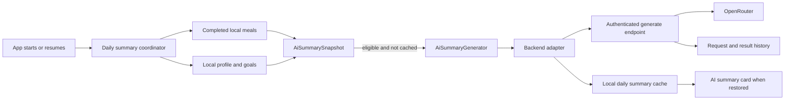

# AI-summary simplification and reliability

Status: Direction confirmed; telemetry guard applied; feature implementation not started

Last reviewed: 2026-08-25

## Objective

Generate at most one nutrition summary per local day from the meals that are
actually saved on the phone. This includes manual meals and meals logged from a
favorite, even when they have no backend analysis session.

The app will try to catch up only while it is in the foreground. It will send a
small, explicit snapshot to an authenticated backend endpoint. The backend will
generate the prose through OpenRouter, preserve the existing
`AiMealSummaryResponse`, and retain the validated request beside the generated
summary for user-scoped diagnostics.

This plan replaces the current hourly cron and OpenAI Batch flow. It does not
add general meal synchronization.

## Final vision



The coordinator, snapshot, response, and cache do not know which model runs the
generation. Initially, `BackendAiSummaryGenerator` calls the backend, which
uses OpenRouter. Later, `GeminiNanoAiSummaryGenerator` can consume the same
snapshot and return the same response without changing collection, caching, or
the UI. Firebase authentication belongs to the backend adapter, not the
coordinator or local cache, so a future Nano adapter can run without a network
identity.

There is deliberately no WorkManager task. If the app is not opened or resumed,
no summary is generated that day. The next foreground opportunity considers
only its current local date; it does not backfill missed dates. This trades
background freshness for a much smaller and more reliable implementation.

## Confirmed product decisions

- Run a non-blocking catch-up after normal app initialization and whenever the
  app resumes. The lifecycle observer lives at app scope, above the router,
  rather than inside the home screen. The coordinator itself depends only on
  local initialization; Firebase availability is an adapter concern.
- Do not use WorkManager, a headless isolate, exact-time scheduling, or
  background retries.
- Generate no more than one completed summary for an authenticated user and
  local date.
- Allow at most three remote provider attempts for that user/date, separated by
  a 15-minute cooldown. Recover an abandoned processing claim after two
  minutes.
- Summarize the seven completed local calendar days ending at the start of
  today. Never include today's partial data.
- Generate only when yesterday has at least two meals, or the last four
  completed days have at least three meals.
- A meal logged from a favorite counts after it is saved to the normal meal
  table. A favorite template that was not consumed does not count.
- Edits made after today's summary completes appear in tomorrow's overlapping
  window. There is no same-day regeneration.
- Send only saved meal nutrition, locale/timezone, and the allowlisted profile
  and goal fields defined below.
- Do not include calories burned or any other Health Connect data.
- Use OpenRouter for remote generation. Do not fall back to direct OpenAI.
- Keep the current `AiMealSummaryResponse` fields and wire format.
- Store each accepted daily request and its result in the backend's summary
  history with timestamps.
- Keep normal application retention. Do not add feature-specific consent,
  deletion, or retention workflows.
- Treat this as a single-device feature. Cross-device merge and conflict
  handling are out of scope.
- Keep the home AI-summary card hidden until the new path is ready.

## Boundary with meal analysis and favorites

The [meal-analysis robustness plan](meal-analysis-robustness.md) has landed on
`main` and is the baseline. This work must not change its V2 envelopes,
decomposition, USDA resolution, clarification, no-food, retry, or presentation
decisions.

The summary input boundary is the final locally persisted `LoggedMeal`.
Pending or failed analyses and no-food results contribute nothing because they
have not produced a saved meal. How the meal was created is irrelevant after it
reaches that table:

- remote or local analysis;
- manual entry;
- an edited meal;
- quick-add or restoration from a favorite.

Favorite templates remain in their own table and are never uploaded merely
because they are favorites. The normal favorite logging path already writes a
consumed copy into the final meal table, so no favorite-specific backend sync is
needed.

Do not widen
[`MealLogSyncService`](../../app/lib/core/services/meal_log_sync_service.dart).
Its analysis-session synchronization is unrelated to this bounded summary
request.

## Current flow and why it is being removed

The current backend flow:

1. Reads meals represented by `meal_analysis_session`.
2. An hourly cron selects users near a local 03:00 window.
3. It submits an OpenAI Batch job and later polls the batch.
4. It stores prose in `ai_summaries` and batch state in
   `ai_summary_batches`.
5. `GET /api/v1/food/ai-summary` returns the latest stored summary and may
   re-read analysis sessions to reconstruct missing statistics.

This misses manual, favorite-based, and other local-only meals. It also adds a
cron clock, provider batch lifecycle, polling, reconciliation, and stale-data
fallbacks to a once-daily feature.

Relevant legacy surfaces are the
[cron](../../backend/src/jobs/aiSummaryCron.ts),
[generation service](../../backend/src/services/aiSummaryService.ts),
[statistics calculator](../../backend/src/services/aiSummaryStats.ts),
[V1 route](../../backend/src/routes/v1/food.ts), and
[observability service](../../backend/src/services/userObservability.ts).

## Input contract

### Local meal query

Add one database method:

```dart
Future<List<LoggedMeal>> getMealsBetween(
  DateTime startInclusive,
  DateTime endExclusive,
);
```

For a summary date `D`, query `[D - 7 days, D)` in the device's current
timezone. Apply both bounds and order by timestamp, then local row ID for stable
processing. The row ID is only a local tie-breaker and is not uploaded.

Do not reuse
[`watchAllMealsForLast7Days`](../../app/lib/core/db/app_database.dart) as-is.
It is a stream, starts six days before today, includes today, and has no upper
bound. The summary needs a one-shot query over seven completed calendar days.

Reject the attempt locally if the window contains more than 100 meals. Do not
silently truncate it. The backend enforces the same cap.

### Snapshot sent to the generator

`AiSummarySnapshot` contains:

```json
{
  "summaryLocalDate": "2026-08-25",
  "timezone": "Asia/Kolkata",
  "locale": "en-IN",
  "meals": [
    {
      "loggedAt": "2026-08-24T13:10:00+05:30",
      "name": "Vegetable pulao",
      "mealType": "LUNCH",
      "calories": 510,
      "protein": 14,
      "carbs": 82,
      "fat": 14,
      "fiber": 8
    }
  ],
  "context": {
    "weightGoal": "MAINTAIN_WEIGHT",
    "activityLevel": "MODERATELY_ACTIVE",
    "dailyCalorieGoal": 2100
  }
}
```

Rules:

- `summaryLocalDate`, IANA timezone, and locale are required.
- `loggedAt` is the saved meal instant serialized as RFC 3339.
- Meal name, type, calories, protein, carbs, fat, and fiber come from the final
  saved meal. Nutrients are finite, non-negative integers.
- The three context fields are independently optional. Omit a value when it is
  not set instead of inventing a default.
- Do not send local IDs, analysis IDs, favorite IDs, quantities, images,
  health-score labels, raw profile measurements, or Health Connect data.
- Do not add client hashes, schema versions, window timestamps, sync metadata,
  or a generic metadata bag. The server can derive the seven-day window from
  the local date and timezone.

The exact validated JSON request is what the backend stores for diagnostics.

## Sparse-data and edit behavior

Before any network request, count meals in the snapshot using the same
calendar-day boundaries:

```text
yesterdayMealCount >= 2
OR
lastFourCompletedDaysMealCount >= 3
```

If the threshold is not met, stop quietly. Do not create a completed cache row
and do not call the backend. A later resume on the same day may reevaluate,
which allows a newly added backdated meal to make the snapshot eligible without
maintaining hashes or special insufficient-data state.

The backend repeats the threshold check before calling OpenRouter. This protects
the cost boundary from malformed or older clients.

Once a completed row exists for the local date, every later foreground trigger
is a no-op. Changes to a completed date are intentionally reflected only in the
next day's window.

## App implementation

### Generator boundary

```dart
abstract interface class AiSummaryGenerator {
  Future<AiMealSummaryResponse> generate(AiSummarySnapshot snapshot);
}
```

- `BackendAiSummaryGenerator` serializes the snapshot and calls the new
  backend endpoint. It alone resolves Firebase authentication and reports an
  unavailable generator when no authenticated user exists.
- A future `GeminiNanoAiSummaryGenerator` will use the same input and output
  types and will not require Firebase authentication.
- Do not make summary generation a meal-analysis method on
  [`LocalInferenceService`](../../app/lib/core/services/local_inference_service.dart).
  The existing Gemini Nano runtime/channel can be reused later, but meal
  analysis and daily summaries are separate capabilities.
- Keep deterministic statistics inside each adapter's implementation boundary.
  The backend computes them initially. If Nano is added, port the small pure
  calculator and its fixtures then; do not build cross-language
  canonicalization infrastructure now.

### Minimal local cache

Add a `local_ai_summaries` Drift table keyed by:

```text
summary_local_date
```

Store only the serialized `AiMealSummaryResponse`; its existing `generatedAt`
field carries the generation timestamp. Do not persist the request locally.
Include this table in the existing local `clearAllData()` transaction. After a
clear, the empty completed-day window is ineligible, so the backend's retained
row is not fetched back into the app; newly logged meals enter a later summary
date under the normal window policy.

This row is both the completion gate and the eventual UI source. It replaces a
separate sync-state table, input hashes, and backend-only reads. This matches
the current database, whose meals and profile are device-local rather than
account-partitioned. Backend idempotency remains scoped by authenticated UID
and local date.

When the card is restored, it should read the current-date local row. It must
not silently present an old backend summary as today's result. For
`UNSPECIFIED` trend, omit the trend chip rather than labeling it steady.

### Foreground coordinator

On app startup and every lifecycle resume:

1. Wait until the local database is ready.
2. Capture the current local date, timezone, and locale once for the attempt.
3. If the local cache already contains that date, stop.
4. Read the seven completed local days and enforce the 100-meal cap.
5. Apply the sparse-data threshold.
6. Read the optional local profile/goal fields and build the snapshot.
7. Immediately before generation, capture the date and timezone again. If
   either changed, discard the snapshot and rebuild once for the new date.
8. Call the injected generator without blocking initial home rendering. The
   backend adapter stops quietly when Firebase authentication is unavailable;
   a future Nano adapter can continue locally.
9. Persist the returned response in the local daily cache.

Use one in-memory single-flight guard so startup and resume cannot run the
coordinator concurrently. Keep the latest transient-failure time in memory and
do not retry for 15 minutes. Do not add persistent app retry state. A transport
or provider failure leaves no completed local row, so a later startup/resume
may retry. The backend enforces the cooldown and attempt cap across app
restarts, and daily idempotency handles a lost response after a successful
provider call. Honor server `Retry-After` values for active/cooling-down rows.
Generator unavailability before a provider attempt, including missing Firebase
authentication, does not start the failure cooldown or consume an attempt.

## Backend implementation

### Direct endpoint

Add:

```text
POST /api/v1/food/ai-summary/generate
```

The endpoint:

1. Authenticates the Firebase user and never accepts `userId` from the body.
2. Validates the snapshot, field bounds, meal timestamps, seven-day window, and
   100-meal cap. The supplied summary date must equal the current calendar date
   derived from server time in the supplied IANA timezone.
3. Rechecks the sparse-data threshold.
4. Atomically claims the user's local date in `ai_summaries`.
5. Computes deterministic response statistics.
6. Calls OpenRouter only for bounded summary prose.
7. Validates the model output, completes the stored row, and returns the
   unchanged `AiMealSummaryResponse`.

If that UID/date is already complete, return its stored response without
calling OpenRouter. Claim all other attempts atomically using the same daily
row:

- A `processing` row younger than two minutes returns `202 Accepted` with
  `Retry-After`; the app does not poll it.
- A `processing` row at least two minutes old is stale and may be reclaimed.
- A `failed` row may be reclaimed only when its last attempt is at least 15
  minutes old and fewer than three provider attempts have been made.
- A row that has reached three failed provider attempts returns `429` with a
  retry time at the next local date. It never calls OpenRouter again that day.

Increment the attempt count only when a request successfully claims the row and
is about to call OpenRouter. Validation, sparse-data rejection, an active claim,
or missing authentication do not consume an attempt. The two-minute stale
threshold must remain longer than the configured OpenRouter request timeout.
This row is the only durable retry/concurrency mechanism needed.

If the server rejects a request because midnight passed between snapshot
capture and receipt, return a machine-readable `summary_date_changed` conflict
before claiming the row. While still foregrounded, the app rebuilds once using
the new date and timezone; if either changes again, it stops until the next
resume. This does not backfill the previous date.

### OpenRouter generation

Use the existing OpenAI-compatible Node client with:

- `OPENROUTER_API_KEY`;
- `OPENROUTER_BASE_URL`;
- a new required `OPENROUTER_AI_SUMMARY_MODEL` model slug;
- `POST /api/v1/chat/completions`;
- `stream: false`;
- strict JSON Schema structured output containing only a bounded, non-empty
  `summary` string;
- `provider.require_parameters: true`, so only endpoints supporting the
  requested structured-output parameters are selected;
- `provider.data_collection: "deny"`, while retaining OpenRouter's normal
  provider fallback for the configured model.

Do not add direct OpenAI or free-router fallback attempts for summaries. Do not
send the Firebase UID, local IDs, or other user identifiers to OpenRouter. Keep
OpenRouter prompt/completion logging and data-use opt-ins disabled.

Serialize meal names as untrusted data and explicitly instruct the model never
to follow instructions found inside them. Validate the returned summary for the
schema and length before persistence even when structured output succeeds.

`store: false` is not part of this request. It is an OpenAI Responses API
option meaning “do not save this response for later retrieval through the
OpenAI API.” It does not control Calorify's database and is not the privacy
control for an OpenRouter Chat Completions request. OpenRouter routing and
account privacy settings are used instead.

The configured OpenRouter model must advertise structured-output support before
deployment. Model selection remains deployment configuration, not application
branching logic.

### Deterministic response fields

OpenRouter generates only `summary`. The backend owns:

- `generatedAt`: completion timestamp;
- `mealCount`: number of validated meals;
- `topFoods`: top three names after trimming, collapsing whitespace, and
  case-insensitive grouping;
- `macroBalanceScore`: preserve the existing fixed 50% carbohydrate, 20%
  protein, and 30% fat compatibility calculation, clamped to 0–100;
- `trend`: compare average daily logged calories in the latest three completed
  days with the preceding three completed days.

For trend, require meals on at least two distinct days in each three-day period.
Use `UP` for a change of at least +10%, `DOWN` for at most -10%, and
`STEADY` otherwise. Return the existing `UNSPECIFIED` value when either
period lacks enough coverage. The prose prompt must not claim a calorie trend
when trend is `UNSPECIFIED`.

### Summary history and diagnostics

Reshape the existing `ai_summaries` table instead of adding a parallel
history system. New daily rows need:

- `user_id`;
- nullable `summary_local_date` for legacy-row compatibility, required for
  new rows;
- `status` (`processing`, `completed`, or `failed`);
- `request_snapshot JSONB`;
- `requested_at` and `generated_at`;
- existing summary/statistic fields, with `summary` and `generated_at` nullable
  until the row is completed;
- `provider`, `model`, and provider request ID when available;
- `attempt_count`, a bounded last error code, and processing start time.

Add a partial unique index on `(user_id, summary_local_date)` where the date is
not null. A retry updates the same daily row; a completed row is immutable.
Keep the exact validated request that produced the completed summary. Do not
duplicate the response into another JSON snapshot when the existing summary and
statistics fields already contain it. Migrate legacy rows as completed while
leaving their unavailable request snapshot and local date null.

When a failed or stale row is claimed again, replace `request_snapshot` and
`requested_at` with that validated attempt. The completed row therefore retains
the exact request that produced its summary rather than the first failed input.

Extend the existing user-inspection/observability output to list these rows for
an explicitly selected user, including timestamps, request snapshot, result,
provider/model, and bounded failure metadata. Do not include request bodies or
meal names in general logs or metrics.

## Legacy cleanup and rollout

Use a short global transition, not per-user adoption markers or a permanent
dual flow:

1. Add the direct endpoint, daily summary schema, and OpenRouter implementation.
2. Stop the cron from submitting new legacy batches.
3. Let already-submitted batches reach a terminal state, then remove their
   poller/reconciliation code.
4. Release the foreground coordinator and local cache while the card remains
   hidden.
5. Remove `aiSummaryCron`, batch generation/polling services and tests,
   `ai_summary_batches`, the summary CLI, and startup registration.
6. Remove every AI-summary read of `meal_analysis_session`, including GET
   fallback statistics.
7. Switch the card/provider to the local cache before restoring the card, then
   remove the legacy GET repository/provider/route when unused.
8. Remove summary-only OpenAI model constants and configuration.
9. Remove the home screen's legacy 15-minute `aiSummaryProvider` invalidation
   and its resume-time invalidation. Keep unrelated dashboard and Health Connect
   refresh behavior.

Old completed `ai_summaries` rows may remain as history with a null local
date. They must not participate in new daily idempotency or local-card reads.

## Deliberately omitted complexity

- WorkManager, alarms, background isolates, and platform scheduling.
- Missed-day backfill.
- Client input hashes or cross-language canonical JSON.
- Insufficient-data cache rows.
- A separate local sync-state table.
- Same-day regeneration and hash-conflict handling.
- Per-user migration/adoption markers.
- A second stored response snapshot.
- Generic meal synchronization.
- Multi-device conflict resolution.
- Feature-specific consent, deletion, or retention policy.
- Health Connect and calories-burned inputs.
- A local Nano implementation in this phase.
- A custom provider fallback graph; OpenRouter routes the one configured model.

## Gap audit

| Risk or edge case | Simple handling |
| --- | --- |
| App never opens that day | Accepted foreground-only tradeoff; generate only on a later current-day opportunity. |
| Startup and resume overlap | One in-memory single-flight guard. |
| Provider succeeds but response is lost | Backend UID/date uniqueness returns the completed row on retry. |
| Provider repeatedly fails | Enforce a 15-minute cooldown and at most three provider attempts per UID/date in the existing daily row. |
| Backend dies while processing | Atomically reclaim a processing row after two minutes. |
| Sparse data changes during the day | Reevaluate on each foreground opportunity until a summary completes. |
| Meal is edited after completion | Include the edit in tomorrow's overlapping window. |
| Favorite is never consumed | Template is excluded; only final logged meals count. |
| Future-dated or today's meal leaks in | One-shot query and backend validation enforce `[D - 7 days, D)`. |
| Very large local history | Reject above 100 meals; never truncate silently. |
| Missing profile field | Omit it; meal eligibility is independent of profile completeness. |
| Weak trend coverage | Return `UNSPECIFIED` and hide the trend chip. |
| Firebase auth is unavailable | The backend adapter stops; a future Nano adapter remains usable because the coordinator/cache do not require auth. |
| Auth identity changes | The device-local cache remains aligned with the device-local meal database; backend rows remain UID-scoped. |
| Local clear-all | Delete the local summary cache in the same transaction; the now-empty completed-day window prevents re-fetch. |
| Timezone or DST changes | Capture one IANA timezone/local date per attempt and use calendar boundaries, not rolling hours. |
| Midnight occurs during catch-up | Rebuild once for the new current date before any provider call; never backfill the old date. |
| OpenRouter endpoint ignores schema | Set `require_parameters: true` and validate the returned JSON again. |
| Provider may retain/train on data | Set `data_collection: "deny"` and keep OpenRouter content logging/data-use opt-ins off. |
| Meal payload appears in telemetry | Measure HTTP-body capture is disabled; backend logs remain metadata-only. |
| Nano is added later | Replace the generator adapter; keep snapshot, cache, coordinator, and response unchanged. |
| Legacy batch is already in flight | Stop submissions first, drain terminal batches, then remove polling and table. |

No remaining architecture decision blocks implementation. Deployment must choose
one explicit OpenRouter summary model that supports strict structured output.

## Implementation checklist

### App

- [ ] Add the completed-day `getMealsBetween` query to the database interface
  and Drift implementation.
- [ ] Add `AiSummarySnapshot`, its narrow mapper, and validation.
- [ ] Add the date-scoped local summary cache migration and include it in
  `clearAllData()`.
- [ ] Add `AiSummaryGenerator` and `BackendAiSummaryGenerator`.
- [ ] Add the app-scoped foreground startup/resume coordinator, single-flight
  guard, 15-minute in-memory failure cooldown, and one-time date-change rebuild.
- [ ] Keep the existing card commented out.
- [ ] Change the hidden card/provider to use the local cache before restoration.
- [x] Set Measure `trackHttpBody` to `false`.

### Backend

- [ ] Add the authenticated direct-generation request schema and route.
- [ ] Reshape `ai_summaries` for daily idempotency, request history, and
  processing recovery.
- [ ] Implement the three-attempt daily cap, 15-minute failed-attempt cooldown,
  two-minute stale-processing recovery, and machine-readable retry responses.
- [ ] Add the deterministic stats implementation and sparse-data validation.
- [ ] Add the OpenRouter-only structured-output client and required model
  configuration.
- [ ] Extend user-scoped diagnostics with request/result history.
- [ ] Add redacted outcome/duration metrics without payloads or user IDs.

### Cleanup

- [ ] Stop new legacy batch submissions.
- [ ] Drain already-submitted batches.
- [ ] Remove cron startup, batch/poller/reconciliation code, batch table, and
  summary CLI.
- [ ] Remove analysis-session summary input and fallback statistics.
- [ ] Remove the unused backend GET and app network-read path after the local
  cache is the sole card source.
- [ ] Remove the home screen's periodic and resume-time legacy AI-summary
  invalidations without removing unrelated refreshes.
- [ ] Remove summary-only direct-OpenAI constants and configuration.

### Verification during implementation

- [ ] Query boundaries cover seven completed local days across DST changes.
- [ ] Manual, edited, local-analysis, remote-analysis, and consumed-favorite
  meals produce the same input shape.
- [ ] Favorite templates, today's meals, future meals, images, IDs, Health
  Connect data, and unallowlisted profile data are excluded.
- [ ] Sparse thresholds cover both qualifying branches and just-below cases.
- [ ] Multiple foreground triggers and concurrent POSTs cause one provider call.
- [ ] Failed attempts respect cooldown/cap, a stale processing row can recover,
  and a completed row cannot regenerate.
- [ ] A midnight or timezone change rebuilds at most once and never generates
  for the previous date.
- [ ] Local clear-all removes the cached summary and cannot immediately
  rehydrate it from the retained backend row.
- [ ] A fake local generator can complete and cache a summary without Firebase
  authentication, demonstrating the Nano boundary.
- [ ] Invalid OpenRouter JSON, timeouts, and provider errors remain retryable
  without corrupting local or backend state.
- [ ] Stored diagnostics reproduce the exact validated request and typed result.
- [ ] The response remains wire-compatible with current clients.
- [ ] The restored card hides `UNSPECIFIED` trend and never shows an old row as
  today's summary.

## Acceptance criteria

- Every final saved local meal in the completed seven-day window is eligible,
  including consumed favorites and manual meals.
- No summary uses `meal_analysis_session` as an input.
- An eligible foreground catch-up produces at most one completed summary per UID
  and local date.
- Ineligible snapshots do not call OpenRouter.
- Remote generation goes through OpenRouter only and returns the unchanged
  `AiMealSummaryResponse`.
- The app stores the result locally, and the backend stores the validated
  request and generated result with timestamps.
- A future Gemini Nano adapter can replace the backend adapter without changing
  collection, coordination, cache schema, or UI consumption, and without
  requiring Firebase authentication.
- Legacy cron, batch, polling, CLI, and analysis-session summary code are
  removed after the short global transition.
- HTTP request bodies containing meal/profile context are not captured by
  Measure telemetry.

## References

- [OpenRouter Chat Completions quickstart](https://openrouter.ai/docs/quickstart)
- [OpenRouter structured outputs](https://openrouter.ai/docs/guides/features/structured-outputs)
- [OpenRouter provider routing and data policy](https://openrouter.ai/docs/guides/routing/provider-selection)
- [OpenRouter data collection](https://openrouter.ai/docs/guides/privacy/data-collection)
- [OpenAI Responses `store` parameter](https://developers.openai.com/api/reference/cli/resources/responses/methods/create)
