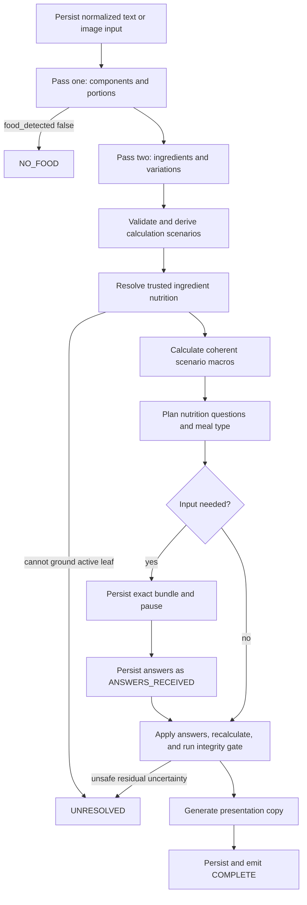

# Meal-analysis backend rewrite

Status: two-pass CLI hypothesis implemented; durable backend and client cutover pending

Last reviewed: 2026-08-30

## Objective

Replace the current meal-analysis core and developer CLI with a small,
explicit, and resumable workflow that turns either text or an image into a
quantified ingredient recipe, resolves every nutrition-bearing ingredient
against trusted nutrition data, calculates point macros and plausible ranges,
asks only meaningful questions, and produces a localized presentation.

The rewrite prioritizes truthful uncertainty over false precision. A result is
complete only when every active nutrition-bearing ingredient has trusted
calorie, protein, carbohydrate, and fat data; fiber is sourced when available
and otherwise normalized to zero; and the final integrity checks pass.

This is the single canonical cross-component plan for the rewrite. It replaces
the earlier incremental meal-analysis reliability plan. The currently deployed
workflow remains described by the
[meal-analysis state machine](../../backend/docs/meal-analysis-state-machine.md)
until the cutover is complete.

## Confirmed decisions

- Input is exactly one of text or image. Combined image-plus-caption input is
  out of scope.
- Text may be in any language. Language handling is model-assisted best effort;
  the rewrite will not add hand-maintained locale-specific parsers.
- The client supplies locale, ISO country code, IANA time zone, capture
  timestamp, and image origin when applicable. Locale controls presentation
  language, country is a weak regional prior, and fresh immediate-camera time
  plus time zone may inform meal type.
- Image analysis assumes that the entire visible serving was consumed.
- Every food component is represented by a quantified ingredient recipe.
  Prepared-dish calorie records are not an authoritative calculation path.
- Interpretation is split into two compact structured model calls. Pass one
  detects food and extracts meal components, portions, preparation, and meal
  type. Pass two decomposes those exact components into quantified ingredients
  and declares only compact, material variation descriptors. Models never
  provide authoritative calories or macros.
- The two model contracts use the agreed names (`food_detected`,
  `mealNameCandidate`, `mealTypeCandidate`, `componentName`,
  `canonicalIdentity`, `portion`, `preparation`, `ingredients`, and
  `variations`). Do not rename these fields while moving the hypothesis into
  the durable flow.
- Model-facing origin has only two non-null values: `user_text` for information
  explicitly supplied by the user, including a clarification answer, and
  `model_inferred` for everything else, including image observations and
  context defaults. An unresolved meal type uses `value: null, origin: null`.
- Every nutrition-bearing ingredient must resolve against trusted data. No
  unreviewed model-generated nutrition fallback is allowed.
- Packaged, branded, restaurant, and proprietary foods still receive a
  best-effort ingredient decomposition. Their uncertainty must remain broad
  when the recipe is not observable.
- The final API carries point estimates and plausible ranges for calories,
  protein, carbohydrates, fat, and fiber. The app initially displays only the
  calorie point and calorie range.
- A verified nutrient value of zero is valid. By explicit product policy,
  missing fiber is also treated as zero. Missing calories, protein,
  carbohydrates, or fat remain unresolved when source presence is available.
- One bounded question bundle contains one to three nutrition questions when
  nutrition clarification is warranted, otherwise none. Only questions with
  material expected impact are included.
- Meal type may add one separate question and does not count against the
  one-to-three nutrition-question budget.
- Residual low-impact uncertainty remains in the final range. After the one
  question round, a versioned deterministic safety predicate decides whether
  the remaining range may complete or must become `UNRESOLVED`.
- The final presentation separates `mealName`, `servingSizeText`, and `tip`.
  The name never contains serving size or weight. Serving size uses concise
  natural measures and never contains calories, grams, or other weight text.
  The tip may contain any meal-related copy, including trivia.
- On-device meal analysis will be forcibly disabled in backend capability
  policy and clients at cutover and is out of scope for this rewrite.
- The rewrite does not preserve V2 payload compatibility, old-client support,
  or replay of old in-flight sessions. Backend and app cut over together.
- LangGraph will not be introduced. The workflow is a fixed typed pipeline with
  one bounded human-input boundary; a small explicit runner is sufficient.

### Accepted temporary fiber limitation

The hypothesis CLI reuses any active materialized USDA snapshot and does not
force a second source download merely to populate nutrient-presence flags.
Missing fiber is normalized to `0` in every V3 result. On legacy snapshots,
all numeric nutrient columns are accepted as previously imported because their
original presence metadata cannot be reconstructed.

This is an explicit accuracy tradeoff for the current hypothesis: omitted
fiber can be indistinguishable from true zero and may understate fiber or make
its range too narrow. Values still come from stored USDA numeric columns, not
the model, but a legacy zero in any nutrient cannot be audited as
source-present. Revisit this after the CLI hypothesis is evaluated; possible
later work is a resumable cached source refresh or another trusted way to
materialize presence without repeated downloads.

## Scope boundaries

### Retain

- authenticated API access and image ownership checks;
- storage of image object keys rather than bearer URLs;
- client-stable analysis IDs and request idempotency;
- durable checkpoints, terminal replay, worker leases, and stale-worker
  fencing;
- trusted nutrition storage and lookup infrastructure;
- logging, metrics, history inspection, feedback, reanalysis, CSV export, and
  meal-log confirmation, updated for the new state;
- one application core shared by CLI and HTTP.

### Replace

- the current flat ingredient decomposition;
- the existing portion-template and dish-template correction chain;
- model-provided free-form preparation states and the current calorie-only
  clarification heuristic;
- LLM-generated nutrition fallback;
- LLM-generated authoritative quantity text;
- the current meal-analysis CLI behavior and its automatic answer defaults;
- snapshot codecs, stages, prompts, schemas, and tests tied to the old internal
  state.

### Defer

- on-device interpretation and local nutrition settlement;
- image plus user caption input;
- barcode, label OCR, and exact packaged-product nutrition;
- restaurant-chain or brand-specific recipe integrations;
- user-calibrated bowl, cup, plate, or utensil sizes;
- micronutrient calculation;
- more than one nutrition clarification round;
- automatic learning from user corrections;
- compatibility adapters for old clients or sessions.

These deferred capabilities can improve accuracy, especially for packaged
foods and images, but are not required for the first reliable backend flow.

## Domain model

### Meal and component hierarchy

```text
Meal
  -> Component[]                   // pass one
       -> Portion
       -> Preparation
       -> Ingredient[]             // pass two
            -> AmountGrams
            -> TrustedNutritionReference
       -> Variation[]              // pass two
       -> CalculationScenario[]    // derived deterministically, never model output
```

A component is the food-level unit a user recognizes, such as `daal`, `roti`,
`banana shake`, or `fried egg`. Ingredients are nutrition-bearing
leaves such as pumpkin, flour, retained oil, milk, or sugar.

Only ingredient leaves contribute macros. Components and the meal aggregate
their children and never add a second dish-level calorie value.

Atomic foods use the same model with a one-leaf recipe. A banana, for example,
has one banana leaf rather than an invented list of sub-ingredients.

### Names and identity

Keep these concepts separate:

- `componentName`: the concise food term returned by pass one;
- `canonicalIdentity`: the stable English identity used for nutrition lookup;
- presentation wording is generated later and never changes calculation
  identity.

Country and locale may change final presentation, such as presenting `roti` as
`Indian flatbread` for an English-speaking US context. They may not silently
change the canonical food identity or override explicit preparation details.
Country may also inform model-proposed regional ingredient recipes when a
variation is nutritionally material, but it remains a weak prior and never a
hand-coded locale rule or a substitute for source evidence.

### Origin and uncertainty

The model contracts intentionally distinguish only `user_text` from
`model_inferred`. This answers the only product-relevant question: did the user
explicitly supply the value, or did the system estimate it? Clarification
answers become `user_text`; image-derived and context-derived values remain
`model_inferred`.

Origin and uncertainty remain separate. A user-provided count is clamped to
`min = estimate = max`; a model-inferred unit size or gram conversion may have
a range. The compact calls do not emit evidence objects, source spans, internal
IDs, nutrition basis machinery, question prose, or calculation scenarios.
The normalized original input remains stored beside both responses for audit.

The current hypothesis adapter may translate these two values into legacy
internal provenance while reusing the calculation engine. That translation is
an implementation bridge, not part of the new model or API contract, and must
not leak extra origin values back into either LLM response.

### Portion representation

Portion is a representation of how an amount was expressed, not an intrinsic
food category:

```text
COUNT
AMOUNT
UNKNOWN  // transient only
```

`COUNT` contains a count estimate or exact value and a per-unit finished-size
constraint. Count and unit size remain independent. `4 medium rotis` fixes
count at four while retaining plausible per-roti sizes across scenarios.

`AMOUNT` contains a natural measure when available and a finished-food amount
constraint. Supported measure concepts include grams, millilitres, cup, bowl,
plate, tablespoon, teaspoon, handful, pinch, and serving. `pinch` is a measure,
not a portion kind. `slice` and `piece` use `COUNT`; a fractional slice or piece
is a fractional count, not an `AMOUNT`.

The component stores explicit or observed portion constraints. Every recipe
scenario then supplies one complete point `effectivePortion` compatible with
those constraints. This makes even an atomic food with an image-derived size
range calculable: its small, typical, and large scenarios each have a concrete
point portion rather than one recipe combined with an independent interval.

Rules:

- never default an unspecified food count to authoritative `1`;
- direct user-specified mass clamps only that mass dimension;
- an explicit count clamps count, not per-unit size;
- `small`, `medium`, and `large` select calibrated size bands rather than exact
  gram values;
- cup, bowl, spoon, plate, and volume measures retain conversion uncertainty;
- fractional counts and portions are valid;
- total grams, count, per-unit grams, and natural measures agree within each
  scenario rather than being mutated independently.

### Measurement and nutrition basis

The calculation must distinguish:

- raw ingredient input;
- dry ingredient input;
- edible or retained nutrition-bearing quantity;
- finished cooked yield;
- consumed finished portion;
- countable finished units.

Examples:

- `100 g dry oats cooked with water` binds 100 g to the dry oat ingredient.
  Water changes finished yield but not oat calories.
- `100 g cooked oats` binds 100 g to the finished component.
- `1 cup cooked rice` binds the cup to finished cooked rice, not dry rice.
- frying oil in the pan is not the consumed oil quantity; retained oil is the
  nutrition-bearing ingredient quantity.

The user's explicit measurement basis is immutable. A trusted nutrition record
must match that basis or the recipe must contain one explicit yield conversion.

### Preparation

Preparation uses a small versioned umbrella taxonomy:

```text
RAW
MOIST_HEAT
DRY_HEAT
FAT_HEAT
PROCESSED
COOKED_UNKNOWN
UNKNOWN
OTHER
```

Detail is also a closed, versioned code list rather than arbitrary model text.
Initial codes include boiled, simmered, poached, steamed, pressure-cooked,
baked, roasted, grilled, toasted, sauteed, stir-fried, shallow-fried,
deep-fried, fermented, pickled, dried, smoked, blended, and juiced. Raw evidence
text and localized display labels remain separate from these calculation codes.

A component stores observed preparation constraints. Each scenario contains
the authoritative compatible `effectivePreparationCodes` used for trusted
record matching and calculation. Added or retained fat is an active ingredient
fact because it affects nutrition more directly than the preparation label.
Preparation labels never add calories by themselves.

### Ingredient roles

Each scenario contains only ingredients that are active in that scenario. A
leaf has one calculation role:

```text
ACTIVE_NUTRITION
YIELD_ONLY
IGNORED_TRACE
```

- `ACTIVE_NUTRITION` resolves calories, protein, carbohydrates, and fat,
  sources fiber when available, otherwise uses zero fiber, and contributes once.
  Retained oil or other cooking fat is an active leaf with a retained-fat
  attribute, not a special summation path.
- `YIELD_ONLY` affects mass or concentration and requires a verified zero
  nutrition basis, such as water.
- `IGNORED_TRACE` contributes nothing only under a versioned, tested
  bounded-impact rule. Small quantity alone does not make oil, sugar, butter,
  sauce, or dressing trace.

Presence and variant choices live in scenario-level assumptions. For example,
whole-milk and skim-milk scenarios each contain one active milk leaf; no
`OPTIONAL` or `ALTERNATIVE` leaves coexist inside a scenario.

## Quantified ingredients and derived scenarios

### Why scenarios are required

Pass two returns one quantified point recipe per component. Every ingredient
has `ingredientName`, `canonicalIdentity`, and `amountGrams` with
`min`, `estimate`, `max`, and origin. For a `COUNT` component the ingredient
amounts describe one unit; for an `AMOUNT` component they describe the pass-one
point serving. This rule prevents the same response from ambiguously mixing
per-unit and whole-consumed quantities.

The model does not duplicate whole recipes into lean, typical, and rich
objects. Instead it declares compact variations. Deterministic code expands
the point recipe only as needed for trusted lookup, range calculation, impact
simulation, and answer application. This removes ID management, duplicated
ingredients, yield arithmetic, evidence spans, and cross-field scenario
invariants from the model task.

Internally, each derived calculation scenario contains:

- structured assumptions;
- ingredient leaves with point nutrition-basis grams;
- `finishedYieldGrams` and, for countable recipes, `finishedYieldUnits`;
- one point `effectivePortion`;
- exactly one scale basis: `WHOLE_RECIPE`, `FINISHED_MASS`, or `UNIT_COUNT`;
- authoritative effective preparation and retained-fat state;
- one calculated point `MacroVector`.

Derived scenarios are plausible engineering hypotheses, not probability distributions.
One compatible scenario is explicitly selected as the point scenario. The
extrema across compatible scenarios supply the component macro ranges.

### Calculation

For each scenario:

```text
reference macros = sum(
  ACTIVE_NUTRITION leaf nutrition-basis grams
  * trusted ingredient macros per 100 g
  / 100
)

WHOLE_RECIPE scale = 1
FINISHED_MASS scale = effective portion grams / finished yield grams
UNIT_COUNT scale = effective portion count / finished yield units

component macros = reference macros * exactly one applicable scale
meal macros      = sum(component macros)
```

`WHOLE_RECIPE` covers an ingredient-basis anchor consumed as a whole, such as
`100 g dry oats cooked with water`, without incorrectly scaling it by finished
porridge mass. A `UNIT_COUNT` scenario always carries both yield units and
yield grams. Its derived per-unit grams must agree with the point portion and
its count constraints. Count and finished-mass scaling must never both be
applied to one scenario.

Ingredient proportions, yield, and portion assumptions remain correlated
inside each derived scenario. The hypothesis adapter currently creates the
Cartesian product only within one component and rejects more than 100 derived
scenarios. This is temporary compatibility with the existing calculator, not
an LLM response requirement. Before durable cutover, evaluation must confirm a
smaller marginal representation or a tighter deterministic bound if normal
meals approach this cap.

Clarification answers filter or update compatible scenarios and select exactly
one resulting point scenario, after which the backend recalculates from
leaves. The implementation never patches a stored calorie delta.

Leaves and scenarios carry point vectors only. A component exposes an estimate
from its selected point scenario and per-macro minima/maxima across its valid
scenarios. The meal point is the sum of component points; meal minima and
maxima are sums of the component marginal minima and maxima. Do not construct a
meal-wide Cartesian product. Any genuine dependency between foods must be
modeled inside one component scenario set.

### Uncertainty floors

Model confidence alone cannot determine range width. A model may confidently
propose an unrealistically narrow oil or portion range. Apply a small set of
versioned deterministic floors based on evidence class, not an expanding list
of food-specific exceptions:

- direct mass and count supplied by the user;
- household measure conversion;
- model-inferred text portion;
- image-observed or image-inferred portion;
- restaurant or proprietary recipe;
- sauce, curry, dressing, mixed beverage, or retained-fat uncertainty;
- fried or bone-in food.

Exact floor values are calibrated from evaluation evidence before release.
A floor may add or replace complete coherent scenarios and then revalidate the
set; the post-floor macro envelope must contain the pre-floor envelope. It may
not widen an ingredient, portion, or macro field independently and may not
alter any explicitly supplied user dimension at all. If no coherent floored
scenario can be constructed, the result is unresolved.

When multiple compatible trusted nutrition records exist, their reviewed
dispersion may widen nutrient-density scenarios. A single trusted row remains
a point nutrient reference; the final range is still widened by applicable
recipe, portion, preparation, and evidence floors.

## Trusted nutrition resolution

The model outputs no calories or macros. For every nutrition-bearing leaf, the
resolver must establish:

- hard food-identity compatibility;
- preparation and raw/dry/cooked/drained compatibility;
- a trusted source and dataset version;
- finite, plausible values for calories, protein, carbohydrates, fat, and
  fiber;
- an explicit distinction between a verified zero and a missing non-fiber
  value when the snapshot retains source presence.

`0` is accepted when the trusted record states zero. Missing fiber is also
normalized to `0`. A missing or unparseable calorie, protein, carbohydrate, or
fat value remains unresolved in presence-aware snapshots.

The previous USDA storage/import path could not preserve this distinction
because absent nutrient fields became database zeroes. V3 adds additive
presence flags for future imports, but reuses an existing active materialized
snapshot without forcing another download. Legacy numeric values are accepted
as stored. Consequently, legacy zeroes cannot be audited as source-present and
missing fiber may understate the true fiber amount.

Resolution uses hard identity tiers. Preparation and data-source quality may
break ties only among compatible identities. Ambiguous matches are rejected
rather than selected through an additive score. Duplicate-name nutrient
dispersion, impossible macro mass, missing energy, and raw/cooked inversions
are quality failures.

Calories, protein, carbohydrates, and fat must resolve for every active
nutrition-bearing leaf in every materially plausible scenario before question
planning; fiber is sourced or set to zero. A materially
plausible alternative that cannot resolve is not silently deleted; unless it
qualifies for the bounded trace rule, it makes the analysis `UNRESOLVED`. The
resolver may consult additional trusted datasets in the future, but adding a
dataset does not change the recipe or calculation contracts.

Packaged and proprietary foods do not bypass the recipe rule. Pass two
produces a best-effort quantified ingredient recipe, derived scenarios resolve through trusted
data, and conservative floors preserve the resulting uncertainty.

## End-to-end workflow



### Sanity walkthrough

For text `daal and 4 roti`:

1. Pass one creates `daal` and `roti` components. It preserves count four as
   `user_text`, estimates the daal finished-gram range and per-roti gram range
   as `model_inferred`, and returns no ingredients or alternatives.
2. Pass two returns one quantified daal recipe and one per-unit roti recipe.
   It includes lentils, water, cooking fat, spices, flour, and any plausible
   added fat, then declares only material ingredient amount, variant, presence,
   or preparation uncertainty.
3. Deterministic code expands those compact values into calculable scenarios.
   The roti count stays four while plausible per-roti size varies; the daal
   amount, cooking-fat amount, and cooking-fat identity remain independently
   testable dimensions.
4. All active leaves in all retained scenarios resolve against trusted data
   before questions are ranked. No dish-level calorie guess is used.
5. Likely high-impact nutrition questions concern roti size and daal oil or
   amount. The explicit count is not asked again. An uncertain meal type may be
   included in the same pause outside that one-to-three question budget.
6. Answers filter to resolved scenarios and select one point scenario. If the
   resulting calorie point were `440` with extrema `410` and `470`, the API
   would also carry point/range protein, carbohydrate, fat, and fiber, while
   the app would render only `440 kcal` and `410-470`.
7. The localized meal name contains no quantity. A concise serving label may
   say `4 flatbreads + daal serving`; it does not invent a bowl or expose
   weight. Presentation generation cannot change the nutrition.

This walkthrough becomes a deterministic regression fixture; its reviewed
ingredient quantities and macro targets, rather than the illustrative values
above, determine whether implementation is accurate.

### Two-pass structured interpretation

Use two compact structured calls for either text or image. Both use GPT-5 Nano
through the existing provider chain, run their complete decoder inside each
provider attempt, and expose their exact input, output, timing, provider, model,
and bounded error category in the CLI. Pass two runs only when pass one returns
`food_detected: true`.

#### Pass one: food and components

Pass one performs only food detection, component splitting, point/range
portion inference, one selected preparation method, meal-name candidacy, and
meal-type candidacy. It must not emit ingredients, recipe scenarios,
variations, nutrition, question prose, evidence spans, or internal IDs.

The stable response uses this shape:

```json
{
  "food_detected": true,
  "mealNameCandidate": "Daal with roti",
  "mealTypeCandidate": {
    "value": null,
    "origin": null
  },
  "components": [
    {
      "componentName": "daal",
      "canonicalIdentity": "cooked lentil curry",
      "portion": {
        "kind": "AMOUNT",
        "estimate": 150,
        "min": 120,
        "max": 180,
        "origin": "model_inferred",
        "perUnitGrams": null
      },
      "preparation": {
        "method": "SIMMERED",
        "origin": "model_inferred"
      }
    },
    {
      "componentName": "roti",
      "canonicalIdentity": "whole wheat flatbread",
      "portion": {
        "kind": "COUNT",
        "estimate": 4,
        "min": 4,
        "max": 4,
        "origin": "user_text",
        "perUnitGrams": {
          "estimate": 50,
          "min": 40,
          "max": 60,
          "origin": "model_inferred"
        }
      },
      "preparation": {
        "method": "TOASTED",
        "origin": "model_inferred"
      }
    }
  ]
}
```

Pass-one rules:

- `food_detected: false` is the single no-food/unusable terminal result. It
  returns an empty component list and null meal-name and meal-type values.
- `AMOUNT` values are finished grams by definition, so there is no redundant
  unit field. `COUNT` values are counts and require `perUnitGrams`; every
  amount field ending in `Grams` is always grams.
- Explicit user quantities clamp `min = estimate = max` and use `user_text`.
- Model-estimated values use `model_inferred`, including image observations.
- `mealTypeCandidate` uses null value and null origin when unresolved.
- `mealNameCandidate` never includes count, size, serving text, weight,
  calories, or advice.
- Preparation contains only the selected method. Alternatives belong to pass
  two.

#### Pass two: quantified ingredients and compact variations

Pass two receives the normalized original input and the validated pass-one
JSON. It returns exactly one component entry matching every pass-one
`componentName`. It must not add, remove, merge, or rename components.

For each component it returns a complete quantified ingredient recipe and a
small variation list. Ingredient amounts correspond to the pass-one point
portion; for `COUNT`, amounts are per unit. The response contains no calories,
macros, USDA record IDs, question prose, presentation labels, option objects,
calculation scenarios, or repeated portion ranges.

```json
{
  "components": [
    {
      "componentName": "daal",
      "ingredients": [
        {
          "ingredientName": "lentils",
          "canonicalIdentity": "lentils dry",
          "amountGrams": {
            "estimate": 45,
            "min": 40,
            "max": 50,
            "origin": "model_inferred"
          }
        },
        {
          "ingredientName": "cooking fat",
          "canonicalIdentity": "vegetable oil",
          "amountGrams": {
            "estimate": 8,
            "min": 4,
            "max": 14,
            "origin": "model_inferred"
          }
        }
      ],
      "variations": [
        {
          "variationType": "INGREDIENT_AMOUNT",
          "ingredientName": "cooking fat",
          "alternatives": []
        },
        {
          "variationType": "INGREDIENT_VARIANT",
          "ingredientName": "cooking fat",
          "alternatives": ["ghee"]
        }
      ]
    },
    {
      "componentName": "roti",
      "ingredients": [
        {
          "ingredientName": "whole wheat flour",
          "canonicalIdentity": "whole wheat flour",
          "amountGrams": {
            "estimate": 37.5,
            "min": 30,
            "max": 45,
            "origin": "model_inferred"
          }
        }
      ],
      "variations": []
    }
  ]
}
```

The closed `variationType` enum is:

```text
COUNT
PORTION_AMOUNT
UNIT_SIZE
INGREDIENT_AMOUNT
INGREDIENT_VARIANT
INGREDIENT_PRESENCE
PREPARATION
```

Pass two normally emits only ingredient and preparation variations because
pass-one ranges already express count, portion amount, and unit size. Numeric
alternatives are not repeated: `amountGrams.min`, `estimate`, and `max` are the
three calculation values. `INGREDIENT_VARIANT.alternatives` contains canonical
food identities such as `skim milk` versus a baseline `whole milk`.
`INGREDIENT_PRESENCE` references an ingredient whose zero/nonzero range
represents absence and presence. `PREPARATION.alternatives` contains closed
preparation codes.

The model proposes no more than four variations per component and normally
zero to two. Deterministic calculation may evaluate all declared candidates,
but question planning retains at most one nutrition question per component and
one to three total.

#### Validation and failure behavior

Each pass uses a separate small strict JSON Schema and semantic validator.
Pass-two validation also checks exact component correspondence and validates
the deterministically derived calculation proposal. A validation or provider
failure ends that pass; meal analysis has one OpenRouter attempt and no
fallback. Error telemetry distinguishes the operation names
`interpret_v3_components_*` and `interpret_v3_ingredients_*`.

No model output is silently repaired with food-specific regexes or templates.
The deterministic adapter may create IDs, map the two origin values into
internal calculation provenance, infer mechanical nutrition basis from a
canonical identity, and expand compact variations into calculation scenarios.
Those derived fields are observable but are not fed back into either LLM.

### Clarification planning

Question candidates may target:

```text
COUNT
PORTION_AMOUNT
UNIT_SIZE
INGREDIENT_AMOUNT
INGREDIENT_VARIANT
INGREDIENT_PRESENCE
PREPARATION
```

These names are the canonical `variationType` vocabulary. The current
calculation bridge may map `PORTION_AMOUNT` to its legacy internal
`TOTAL_AMOUNT` representation and specialized fat amounts to the generic
`INGREDIENT_AMOUNT`; those internal names are not part of the new contract.

The planner simulates each candidate answer against the fully resolved scenario
set and measures reduction in normalized meal-macro width. For macro `m`:

```text
normalizedWidth(m) = (max(m) - min(m)) / max(estimate(m), denominatorFloor(m))
expectedWidth(bundle, m) = mean(
  normalizedWidth(m after applying tuple)
  for tuple in validAnswerTuples(bundle)
)
marginalScore(q | bundle) = sum(
  weight(m) * (expectedWidth(bundle, m) - expectedWidth(bundle + q, m))
)
```

Finite options use their option cases. A numeric question persists a unit code,
minimum, maximum, step, and integer-only flag; its bounded permitted values are
the scoring cases. The empty bundle's expected width is the current width.
Valid complete answer tuples use equal weights, so model confidence is not
treated as a probability. `USE_ESTIMATE` is excluded from scoring because it
intentionally reduces no uncertainty. Calories receive the largest product
weight, but protein, carbohydrates, fat, and fiber also contribute, so
similar-calorie alternatives with materially different macros are not ignored.
Denominator floors, macro weights, numeric-domain limits, and score thresholds
are versioned and calibrated.

A candidate must also be answerable. Ask `Was the curry lightly or heavily
oiled?`, not `How many grams of oil were absorbed?`.

Rules:

- emit only one to three nutrition questions;
- select candidates greedily by deterministic marginal bundle impact, not as
  independent top scores;
- keep count and per-unit size for one component in the same atomic bundle;
- support numeric count input rather than mapping `6+` to an invented number;
- persist the exact bundle, option IDs or numeric specifications, impact scores,
  and revision, with no implicitly submitted default;
- require every permitted complete answer tuple to produce a non-empty coherent
  scenario set; cap the bounded tuple space and drop the lowest-impact candidate
  if joint validation would exceed it;
- apply option filters and total numeric scenario transforms jointly, then
  select exactly one point scenario by a stable rank after all answers;
- never regenerate a different bundle on resume;
- apply one answer transaction with compare-and-set revision semantics;
- make `USE_ESTIMATE` impose no new constraint only on that question's
  dimension; other answers in the bundle still apply, and inferred provenance
  remains on the unanswered dimension;
- do not run a second nutrition-question round;
- after answers, keep low-impact residual uncertainty in the result;
- rank exact score ties by component source order, question-kind code, and
  stable question ID;
- return `UNRESOLVED` only when the residual scenario set fails the versioned
  completion-safety predicate.

Absolute and relative impact thresholds are configuration constants calibrated
against the reviewed evaluation set. They are not learned online and are not
hard-coded throughout the implementation.

### Meal type

Meal type is independent of nutrition calculations and may add one question
outside the nutrition-question budget.

Precedence is:

1. user clarification;
2. explicit text such as `breakfast` or `dinner`;
3. reliable capture-time context for an immediate camera image;
4. confident model inference from the meal and supplied context;
5. meal-type question.

The client supplies the capture timestamp, time zone, and image origin:
`CAMERA_NOW` or `GALLERY`. Capture-time defaulting is allowed only for
`CAMERA_NOW` when the timestamp is within a versioned freshness/skew window of
request receipt. Gallery metadata is not evidence of an immediate meal.
Country may inform regional meal conventions but must not determine meal type
by itself. The selected value and its origin are persisted. Meal-type selection
never changes the calculated macros or their ranges.

The pending-input payload may contain up to three nutrition questions plus the
optional meal-type question. Meal type is counted separately even if the app
renders it in the same interaction. Meal-type uncertainty is determined before
the workflow enters `AWAITING_INPUT`, so nutrition and meal type share the only
human-input pause.

### Completion-safety predicate

After planning, or after the single answer bundle, the runner evaluates one
versioned `safeToComplete` predicate. In addition to all identity, nutrient,
scenario, and arithmetic invariants, each macro must satisfy its calibrated
absolute-width cap or its relative-width cap using the same denominator floor
as question ranking. The values are fixed from reviewed development data
before release and recorded with the calculation version. This makes
"high-impact residual uncertainty" deterministic rather than a model judgment.

### Final integrity gate

Before `COMPLETE`, prove all of the following:

1. every asserted food and amount and every runtime-verifiable numeric/unit
   anchor is represented exactly once;
2. every active nutrition leaf has trusted, basis-compatible nutrition;
3. every yield-only leaf has a verified-zero nutrition basis and every ignored
   trace leaf satisfies the versioned bounded-impact exclusion rule;
4. verified zero and missing non-fiber data remain distinct when source
   presence is available; missing fiber follows the explicit zero policy;
5. only active nutrition leaves contribute macros and each contributes once;
6. exactly one whole-recipe, count, or finished-mass scale is applied per
   scenario;
7. every scenario has a coherent yield and ingredient set;
8. clarification answers changed only the dimensions they answered;
9. for every macro, `min <= estimate <= max`;
10. meal point macros equal the sum of component point macros;
11. meal ranges are the marginal extrema across valid component scenarios;
12. the versioned completion-safety predicate passes for every macro;
13. serving-size structured values agree with the portion state;
14. presentation text has not modified calculation state.

Any failure produces a typed terminal or retryable failure rather than a
partial successful result.

## Macro and range contract

Resolved leaves and recipe scenarios carry point values only:

```ts
type MacroVector = {
  caloriesKcal: number;
  proteinGrams: number;
  carbsGrams: number;
  fatGrams: number;
  fiberGrams: number;
};
```

Components and the meal additionally expose ranges across their coherent
scenario sets:

```ts
type MacroEstimate = {
  estimate: number;
  min: number;
  max: number;
};

type MacroEstimates = {
  calories: MacroEstimate;
  protein: MacroEstimate;
  carbs: MacroEstimate;
  fat: MacroEstimate;
  fiber: MacroEstimate;
};
```

The ranges are marginal plausible estimated ranges, not statistical confidence
intervals and not guarantees that every possible real preparation is covered.
Different macro extrema may come from different coherent scenarios.

The explicitly selected point scenario supplies `estimate`. Do not calculate
the point as the midpoint of the final range. Aggregate finite, non-negative
values at full precision and round only at the public boundary. Public calories
are kilocalories rounded to whole numbers; protein, carbohydrate, fat, and
fiber are grams rounded to 0.1 g. Bounds round outward and points use ordinary
nearest rounding.

The public result keeps convenient point values and adds ranges for every
macro:

```json
{
  "macros": {
    "calories": 440,
    "protein": 17.2,
    "carbs": 68.4,
    "fat": 12.8,
    "fiber": 9.1
  },
  "macroRanges": {
    "calories": { "min": 410, "max": 470 },
    "protein": { "min": 15.8, "max": 19.4 },
    "carbs": { "min": 63.1, "max": 73.0 },
    "fat": { "min": 10.4, "max": 15.2 },
    "fiber": { "min": 8.2, "max": 10.1 }
  }
}
```

The app initially renders `440 kcal` with `410-470` and retains the other
ranges in the API and saved analysis snapshot.

## Presentation contract

Presentation runs only after calculation, clarification, and meal-type
resolution. It cannot change components, ingredients, portions, scenarios,
macros, ranges, or provenance.

### Meal name

`mealName` is concise, localized, and based on the final components. It contains
no serving amount, weight, calories, health classification, or advice. Country
and locale may adapt terminology for comprehension while the internal identity
remains unchanged.

### Serving size

`servingSizeText` is a compact projection of validated natural-measure state,
for example `4 rotis + 1 bowl` or `1 mixed plate`.

The backend owns all numeric values and component references. The model may
provide localized component and unit labels, but not replacement counts. The
renderer joins validated segments and enforces:

- no grams, other weight text, or calories, including when the source supplied
  an exact weight;
- no meal name or tip text;
- no number absent from structured portion state;
- no invented bowl, cup, plate, or count;
- a short output-length bound;
- no use as calculation input.

When no permitted concrete natural measure exists, use a concise localized
qualitative label such as `measured portion` rather than exposing weight or
inventing a vessel or count.

### Tip

`tip` is optional localized meal-related copy. It may contain practical advice,
an observation, or trivia. It is presentation-only, is not a nutrition source,
does not affect confidence or calculation, and does not block a valid result if
generation fails.

Presentation-provider failure never discards valid nutrition. Return
`COMPLETE` with a deterministic name assembled from validated component names,
a serving label assembled from validated measure codes or the qualitative
fallback, and an empty tip. This fallback cannot rerun or alter calculation.

## Result and failure outcomes

The core returns one algebraic outcome:

```text
COMPLETE
NEEDS_INPUT
NO_FOOD
UNRESOLVED
RETRYABLE_FAILURE
```

- `COMPLETE` contains calculation and presentation state that passed the final
  integrity gate.
- `NEEDS_INPUT` contains the persisted bounded question bundle.
- `NO_FOOD` means no usable food was detected. It also covers unreadable or
  otherwise unusable images; there is no separate unusable-input product flow.
- `UNRESOLVED` covers nutrition identity, missing required non-fiber nutrient
  data, or
  residual uncertainty that fails the versioned completion-safety predicate.
- `RETRYABLE_FAILURE` covers transient provider, database, or infrastructure
  failures and resumes from the last durable checkpoint.

Use a small stable error-code set rather than free-form workflow branching.
Public copy remains localized separately from machine behavior.

## Architecture

### Pure core

Keep domain calculation and transition logic independent of Fastify, CLI,
PostgreSQL, and model SDKs. The core consists of small typed operations:

```text
normalizeInput
interpretComponents
interpretIngredients
validateProposal
deriveCalculationScenarios
resolveIngredients
calculateScenarios
resolveMealType
planQuestions
applyAnswers
buildPresentation
validateFinalResult
```

External calls sit behind narrow interfaces for interpretation, trusted
nutrition resolution, presentation, storage, clock, and ID generation. Pure
portion, scenario, question-ranking, calculation, and integrity functions use
fixture data in tests.

### Explicit runner instead of LangGraph

Use a switch-based runner that advances one typed durable state. The workflow
has predetermined paths and one bounded input pause. LangGraph would duplicate
checkpoint and interrupt semantics without replacing authorization,
idempotency, compare-and-set answers, or stale-worker fencing.

Reconsider a graph framework only if the product later adds multiple dynamic
tool loops or independently retryable agent branches and it can replace, not
layer over, the persistence model.

### Complexity budget

Keep V3 to two small bounded interpretation operations, a deterministically
bounded scenario set per component, one workflow-state table, one human pause,
and one optional presentation operation. Provider failover is bounded
separately for each pass; neither pass retries or asks the other pass to repair
invalid JSON. Supporting feature tables may be added only where a
real foreign key is required. Do not add a probabilistic inference engine,
food-specific correction chain, payload-compatibility layer, dynamic agent
loop, or second clarification round unless evaluation evidence shows the simple
design cannot meet a recorded release gate.

### Durable state

Use a reduced set of durable stages:

```text
RECEIVED
INTERPRETING
INTERPRETED
CALCULATING
AWAITING_INPUT
ANSWERS_RECEIVED
FINALIZING
COMPLETE
NO_FOOD
UNRESOLVED
```

The active work stages are leased and fenced. A successful write must match
analysis ID, expected stage, and lease token. Failure returns to the preceding
checkpoint. Terminal outcomes replay without rerunning providers.

Persist:

- immutable normalized input and context;
- workflow, schema, prompt, model, resolver, calculation, and dataset versions;
- validated pass-one and pass-two responses, plus derived coherent scenarios;
- trusted nutrition references and calculated snapshots;
- the exact question bundle, revision, and answers;
- meal type and provenance;
- final presentation and result;
- a terminal semantic failure when applicable.

Answer submission atomically transitions
`AWAITING_INPUT@bundleRevision -> ANSWERS_RECEIVED` and persists the complete
answer set. An identical retry is idempotent; a conflicting retry is rejected.
A worker then leases `ANSWERS_RECEIVED`, advances to `CALCULATING`, and applies
the answers. Failure releases back to `ANSWERS_RECEIVED` with the answers
intact, so resume never asks again. A stale worker cannot overwrite answered or
terminal state.

Create a separate `meal_analysis_v3_session` table rather than adding a version
flag to the constrained V2 state table. It stores one current typed snapshot,
lease/fence fields, immutable request identity, and timestamps. After V3
activation, V2 analysis rows are read-only and are never migrated or replayed
by the V3 runner.

The globally unambiguous identity is
`{ workflowVersion, analysisId }`, not a bare UUID. V3 routes imply version 3,
V2 records retain version 2, and combined read models always carry both fields;
the same UUID in two versioned stores is therefore not ambiguous. V3 feedback,
observations, confirmation, and reanalysis-lineage rows use direct foreign keys
to the V3 session rather than polymorphic foreign keys. Version-neutral history
and export adapters union V2 and V3 into the versioned locator. A legacy V2
result may be reanalyzed into a new V3 analysis only after ownership validation;
the V3 session stores its V2 parent locator. Retaining old rows for users does
not imply V2 runtime compatibility.

## CLI-first delivery

The CLI is the first adapter, not a separate implementation. It calls the same
application service and pure core later used by HTTP.

Required CLI capabilities:

- text input and local image input;
- locale, country, time zone, capture timestamp, and image-origin flags;
- deterministic fixed-clock and fixture modes;
- interactive display of the one bounded question bundle;
- `--answers` JSON tied to an analysis ID and bundle revision;
- machine-readable state and terminal JSON;
- ephemeral in-memory execution by default, which cannot resume after process
  exit;
- `--persist` and an explicit analysis ID to use the same configured PostgreSQL
  state adapter as HTTP, including cross-process resume;
- no silent default selection in JSON mode;
- `NEEDS_INPUT` output when answers are required;
- injected trusted-nutrition fixtures for fast tests and the real resolver for
  integration runs.

In `--json` mode, stdout contains machine NDJSON only; prompts and diagnostics
go to stderr. Exit codes are stable: `0` for `COMPLETE` or `NO_FOOD`, `2` for
`NEEDS_INPUT`, `3` for `UNRESOLVED`, `4` for a retryable
failure, and `64` for CLI usage errors. The interactive mode may render concise
human output but still uses the same core.

An in-memory state adapter is sufficient for ephemeral CLI development.
PostgreSQL contract and process-level CLI tests must still prove that the same
core preserves production checkpoint, answer, lease, exit-code, stdout/stderr,
and replay behavior before HTTP cutover.

Add semantic parity tests that send the same fixture through the CLI adapter
and HTTP adapter and compare normalized state, questions, and results.

## API and app cutover

Expose the workflow through these authenticated V3 routes and update backend
and Flutter together:

| Route | Purpose |
| --- | --- |
| `POST /api/v3/food/image-upload` | Validate/upload one image and return an opaque owned `imageId`. |
| `POST /api/v3/food/analyze-text` | Start or idempotently replay text input. |
| `POST /api/v3/food/analyze-image` | Start or idempotently replay an owned image. |
| `POST /api/v3/food/answer` | Atomically submit the one persisted answer bundle. |
| `POST /api/v3/food/resume` | Replay pending input, a terminal result, or resume safe work. |
| `POST /api/v3/food/feedback` | Record feedback against a completed V3 result. |
| `POST /api/v3/food/reanalyze` | Create a new V3 analysis with a versioned parent locator. |
| `POST /api/v3/food/confirm-log` | Idempotently attach the V3 result to a saved meal. |

Creation requests carry a client-generated UUID `analysisId` and a context
object containing a BCP 47 `locale`, ISO 3166-1 alpha-2 `countryCode`, IANA
`timeZone`, and UTC RFC 3339 `capturedAt`. Image requests additionally carry
`imageOrigin: CAMERA_NOW | GALLERY` and an opaque authenticated image ID owned
by the caller, never a bearer URL. Text requests contain one non-empty text
value. Invalid context is rejected rather than silently normalized. The
canonical request digest covers the input identity and the entire context.

Answers use the following closed union; the optional meal-type question uses
the same `OPTION` form:

```json
{
  "analysisId": "uuid",
  "bundleRevision": 1,
  "answers": [
    { "questionId": "q1", "kind": "OPTION", "optionId": "light" },
    { "questionId": "q2", "kind": "NUMBER", "value": 4 },
    { "questionId": "q3", "kind": "USE_ESTIMATE" }
  ]
}
```

`NEEDS_INPUT.data` has one explicit UI contract:

```ts
type PendingQuestion = {
  questionId: string;
  scope: 'NUTRITION' | 'MEAL_TYPE';
  target: { componentId?: string; dimension: string };
  prompt: string; // localized
  response:
    | { kind: 'OPTION'; options: Array<{ optionId: string; label: string }> }
    | {
        kind: 'NUMBER';
        unitCode: string;
        min: number;
        max: number;
        step: number;
        integerOnly: boolean;
      };
  allowUseEstimate: boolean;
};

type NeedsInputData = {
  bundleRevision: number;
  nutritionQuestions: PendingQuestion[]; // zero to three
  mealTypeQuestion?: PendingQuestion;
};
```

Question dimensions and unit codes are closed, versioned enums. Numeric
answers must be finite, on-step, within bounds, and integer-valued when
required.

There is no auto-submitted default. Every question must receive one valid
answer in the atomic submission; `USE_ESTIMATE` is accepted only when that
question advertises it. Dismissing the UI submits nothing, leaves the analysis
in `AWAITING_INPUT`, and a later resume returns the identical bundle.

`COMPLETE.data` contains the following stable top-level fields:

```ts
type CompleteData = {
  mealName: string;
  servingSizeText: string;
  tip: string;
  mealType: {
    value: 'BREAKFAST' | 'LUNCH' | 'DINNER' | 'SNACK';
    origin: ProvenanceOrigin;
  };
  macros: MacroPoints;
  macroRanges: MacroRanges;
  components: ComponentResult[];
  receipt: CalculationReceipt;
};
```

Each `ComponentResult` contains stable component/source/display IDs, the final
point portion and its field origins, closed preparation codes, point macros and
ranges, and the selected point recipe's quantified ingredient summaries. Each
ingredient summary carries its identity, nutrition-basis quantity and unit,
origin, and trusted-reference locator. Alternative scenarios remain in the
durable snapshot and are not sent as presentation data. The Flutter UI consumes
only calorie point/range initially but decodes and preserves all five macros.
`MacroPoints` uses calories in kilocalories and the other four fields in grams;
`MacroRanges` contains `{ min, max }` for the same five closed fields.

`NO_FOOD`, `UNRESOLVED`, and `ERROR` data carry a stable code,
`retryable`, and one recovery action from `RETRY`, `RESUME`, `EDIT_INPUT`,
`UPGRADE_APP`, or `NONE`. Localized UI copy is selected from those codes; server
free text never controls recovery behavior.

Analyze, reanalyze, answer, and resume responses use
`application/x-ndjson`; upload, feedback, and confirmation use ordinary JSON.
After HTTP validation, each streaming request emits `STARTED` followed by
exactly one request-closing event:
`NEEDS_INPUT`, `COMPLETE`, `NO_FOOD`, `UNRESOLVED`, or
`ERROR`. Every line has `{ event, analysisId, data }`. Resume replays the exact
pending bundle or terminal event. If a retryable failure occurs after
`STARTED`, it emits `ERROR` with a stable code and `retryable: true`; a failure
before streaming uses HTTP `503`.

Authentication, ownership, and malformed-input failures use ordinary HTTP
status codes. A stale answer revision or same-ID/different-request collision is
HTTP `409`. Request insertion/replay checks and the answer compare-and-set must
finish before response headers or `STARTED`; a conflict never partially opens a
stream. Repeating the same analysis ID with the same canonical request digest
replays safely. Existing V2 creation and continuation routes return HTTP `426`
with `{ "code": "UPGRADE_REQUIRED" }` after activation and never dispatch V3.

Keep the public error vocabulary small and versioned:

```text
UPGRADE_REQUIRED
UNRESOLVED_NUTRITION
UNCERTAINTY_TOO_HIGH
INVALID_MODEL_OUTPUT
PROVIDER_UNAVAILABLE
INTEGRITY_FAILED
ANALYSIS_BUSY
REVISION_CONFLICT
```

The V3 feedback and confirmation routes accept only completed V3 locators and
write V3 foreign-keyed rows. The V3 reanalysis route accepts an owned terminal
parent locator union `{ workflowVersion: 2 | 3, analysisId }`, plus a new V3
analysis ID and immutable V3 request context. It reads the parent's source
input, creates a separate V3 session, and follows the same NDJSON lifecycle as
analyze. A legacy image can be reanalyzed only if its owned object is still
available and passes V3 validation; otherwise the new analysis returns a typed
unusable result. The protected `/analysis-history` page is a version-neutral
V2/V3 read adapter. The existing meal-history CSV export also remains
version-neutral because V3 confirmation writes the same canonical saved-meal
model; its analysis locator retains the source version.

Cutover requirements:

- old clients fail fast with an explicit non-retryable upgrade response rather
  than repeatedly invoking the new engine with incompatible payloads;
- old in-flight sessions are unsupported and are not migrated;
- backend capability configuration, local proposal/settlement routes, and app
  entry points forcibly disable on-device proposal and local nutrition;
- text and image requests capture the analysis ID and complete request context
  once and persist them unchanged for every retry or resume;
- the app handles the new question bundle and terminal outcomes;
- the app displays calorie point and range while retaining all API macro ranges;
- saved meals continue to use the final point macros;
- feedback, reanalysis, combined V2/V3 history, CSV export, and log-confirmation
  paths adopt the new analysis ID/result contract at cutover;
- the phone owns V3 clarification UI. For watch-originated input that returns
  `NEEDS_INPUT`, the phone preserves the analysis, posts a notification/deep
  link to its exact bundle, and returns `REQUIRES_PHONE` plus `analysisId` on
  the versioned phone-watch protocol. Wear OS never renders questions; it
  receives final/no-food/failure normally after phone completion. Older watch
  protocols fail fast with upgrade-required behavior rather than translation.

### Deployment and rollback boundary

Deployment is staged even though the product cutover is not backward
compatible:

1. Deploy the V3 schema and dark V3 routes while V2
   continues serving existing builds.
2. Publish the V3 phone and watch builds only after V3 readiness, migrations,
   and replay tests pass. Installed V3 builds use only V3; there is no V2
   payload fallback.
3. After the new build is available and V3 gates pass, raise the minimum
   supported build and switch V2 analysis/continuation routes to `426`.
4. Remove V2 execution code only after the forced-update window and rollback
   window close; retain its rows for history.

Before or after step 3, rollback means restoring the last known-good V3 service
or pausing new V3 creation while keeping V3 resume and terminal replay online.
It never means sending a distributed V3 app to a V2-only backend or asking the
old engine to interpret V3 state. This is the accepted cost of no compatibility
layer.

## Evaluation strategy

The initial
[two-pass meal-analysis eval](../../backend/evals/meal-analysis.cases.json)
contains only `4 roti daal`. It isolates the model-facing component and
ingredient passes from deterministic USDA resolution, calories, macros,
clarification, and presentation. Broader text, image, interaction, and
safe-failure cases remain future work.

The evaluator runs an exact caller-selected OpenRouter model with no fallback,
uses five repetitions by default, and reports per-assertion and whole-run pass
rates without enforcing a threshold. Hard checks cover explicit count
preservation, portion semantics and plausible gram windows, provenance,
cross-pass component correspondence, valid variation references, and the core
flour/lentil ingredients. Optional fat/spice coverage and mass coherence are
diagnostic. A one-run GPT-5 nano smoke test scored 16 of 24 hard assertions and
failed the run, confirming that the eval detects the observed count-as-grams
regression without depending on USDA or calorie results.

### Fixture assertions

For each reviewed case, store applicable expectations for:

- component and active-ingredient coverage;
- evidence-span coverage and quantity attachment;
- portion type, count, measure, and measurement basis;
- coherent scenario assumptions and defining ingredient roles;
- preparation and retained-fat state;
- expected trusted identity or allowed identity set;
- pre-question point macros and ranges;
- expected question targets, order, options, and answers;
- post-answer point macros and ranges;
- meal-type value and provenance;
- concise serving-size structured equivalence;
- expected terminal failure where completion would be unsafe.

Include at least:

- atomic and countable foods;
- explicit grams, volume, household measures, and fractional portions;
- raw, dry, cooked, drained, fried, and bone-in foods;
- multi-component meals and composite recipes;
- curries, sauces, dressings, hidden oils, and mixed drinks;
- packaged and proprietary foods;
- multilingual and code-switched text;
- regional household measures;
- clear, occluded, scale-poor, multi-component, and unusable images;
- non-food controls.

### Metrics

Measure:

- component and active-ingredient precision and recall;
- explicit-anchor coverage;
- identity and preparation compatibility;
- point error for every macro;
- interval coverage and interval sharpness for every macro;
- question precision, expected band reduction, answerability, burden, and
  one-round completion;
- appropriate `NO_FOOD` and `UNRESOLVED` rates;
- unsafe-confident success rate;
- repeated-run stability;
- CLI/HTTP semantic parity;
- checkpoint, retry, answer replay, and stale-worker behavior;
- stage latency, provider calls, lookup calls, and cost.

Interval coverage prevents ranges that miss reviewed truth. Sharpness prevents
the trivial but useless strategy of returning an extremely wide range.

### Non-negotiable release gates

- zero unresolved non-fiber nutrients represented as zero; missing fiber uses
  the documented zero policy;
- zero omitted language-specific foods or quantity anchors in the reviewed
  holdout, and zero uncovered runtime-verifiable numeric/unit anchors;
- zero raw/dry/cooked basis inversions in the reviewed holdout;
- zero count, unit-size, yield, or double-scaling invariant failures;
- zero presentation/calculation contradictions;
- zero second nutrition-question rounds;
- every completed result has all five point macros and ranges;
- every terminal result and question bundle replays idempotently;
- calorie and macro interval coverage and sharpness meet thresholds fixed from
  the reviewed baseline before rollout;
- valid-input completion, unresolved rate, question burden, latency, and cost
  meet explicitly recorded go/no-go thresholds.

Run live model cases at least three times with pinned model, prompt, schema,
resolver, and dataset versions. Keep a separate holdout set and record aggregate
metrics without placing raw meal or health data in general logs.

## Implementation sequence

### Phase 1 - Contracts, pure domain, and CLI skeleton

Implementation status: complete for the ephemeral hypothesis runner. Durable
answer revision, persistence, and HTTP parity remain in Phase 6.

- Define the new input, provenance, portion, preparation, recipe scenario,
  nutrition reference, macro range, question bundle, presentation, and outcome
  schemas.
- Implement pure portion/scenario calculation and final invariants.
- Create the new CLI around the shared application interface.
- Add a guided local launcher that starts USDA, reuses an active snapshot, and
  prompts for text or image input and context.
- Add deterministic fixture and property tests for arithmetic and scaling.
- Implement ephemeral JSON stdout, explicit answer input, and exit-code
  behavior; define persisted revision/resume behind the later state interface
  and remove automatic defaults.

Exit: atomic, counted, bulk, dry/cooked, and multi-component fixtures run
through the CLI without provider or database dependencies.

### Phase 2 - Structured text interpretation

Implementation status: compact two-pass model adapter and deterministic bridge
to the existing CLI calculation engine complete. Live repeated multilingual,
image, structured-output reliability, and range calibration remain before
release. A live `gpt-5-nano` text smoke test on 2026-08-30 completed both model
passes through OpenRouter after conditional COUNT/AMOUNT requirements were
moved into the JSON Schema. OpenRouter reported zero reasoning tokens for both
calls. The run then stopped at the separately documented ambiguous USDA
`flatbread` match. This is one successful sample, not evidence of repeated live
provider reliability or output accuracy; it also exposed incorrect provenance
and weak ingredient decomposition that need evaluation. Debug CLI logging
captures finish reason, refusal presence, usage, full model content, and error
bodies as separate pretty-printed JSON files in a unique temporary CLI artifact
directory whose path is printed once to stderr. Full stage observations are
stored there too. Ordered filenames identify the stage or pass, provider,
model, and event. Each model success stores both the provider envelope and the
parsed model output; errors use separate files. Raw payloads are not dumped to
the console. Production requests must keep raw provider logging disabled. Both
smoke-test passes used `reasoning_effort: minimal`, the lowest setting supported
by legacy `gpt-5-nano`, which has no true `none` setting. The active meal-model
defaults are now `gpt-5.6-luna`, and the two V3 interpretation passes use its
supported `none` effort. OpenRouter calls require an
endpoint that supports all requested parameters and use its documented strict
`json_schema` response format.

A subsequent unit-free-contract smoke test correctly omitted `portion.unit`,
but changed the explicit roti count from four to two and returned an unordered
`perUnitGrams` range. Post-schema semantic validation rejected that attempt
before pass two. Cross-field ordering and preservation of explicit anchors
remain release-gate concerns even when provider-level Structured Outputs
accepts the JSON shape.

- Keep separate strict schemas for component/portion parsing and quantified
  ingredient/variation decomposition.
- Run each pass's full parsing and semantic validation inside provider
  failover.
- Preserve only `user_text` and `model_inferred` in model-facing contracts.
- Expand compact ranges and variations into coherent calculation scenarios
  deterministically.
- Evaluate the 100-scenario compatibility cap and replace it with a smaller
  marginal representation before durable cutover if ordinary inputs approach
  it.
- Add best-effort multilingual and regional cases.

Exit: reviewed text fixtures produce two compact valid responses and a fully
calculable proposal, or typed safe failures, without corrective food-specific
regex/template chains.

### Phase 3 - Trusted resolution and calculation

Implementation status: initial local-USDA resolver, legacy-snapshot reuse,
missing-fiber-as-zero handling, optional presence-aware import, coherent
scenario arithmetic, and five-macro ranges complete for the CLI. Calibration
and uncertainty floors remain before release. The current strict resolver can
still terminate an otherwise valid replay as `UNRESOLVED` when the active USDA
snapshot contains several equally ranked exact rows (observed for generic ghee,
vegetable oil, whole-wheat flour, and mixed spices). Search-term construction
and candidate ordering are intentionally unchanged in this iteration; this is
a visible resolver limitation, not a reason to widen or silently choose a row.

- Implement identity-tiered, preparation-aware leaf resolution.
- Enforce four-macro source completeness and the missing-fiber-as-zero policy.
- Keep versioned presence-aware nutrient storage for future imports while
  accepting the existing active materialized snapshot as stored.
- Add resolver quality checks and dataset versioning.
- Apply evidence-class uncertainty floors.
- Produce point and range values for every macro.

Exit: no active leaf can complete without a trusted compatible reference;
missing non-fiber nutrients remain distinguishable when source presence exists,
and missing fiber deterministically becomes zero.

### Phase 4 - Questions and meal type

Implementation status: initial material-impact question policy, one in-memory
answer boundary, recalculation, and meal-type precedence complete for the CLI.
Durable revision and idempotency remain in Phase 6.

- Attribute scenario uncertainty to answerable fields.
- Implement deterministic multi-macro impact ranking.
- Emit and persist one bounded question bundle.
- Apply answers atomically and recalculate from leaves.
- Add optional meal-type question and capture-time defaults.

Exit: every fixture asks no more than three nutrition questions, never asks a
low-impact question, never starts a second round, and preserves residual range.

### Phase 5 - Image interpretation and presentation

Implementation status: local image input, shared image/text interpretation,
deterministic serving text, optional localized name/tip generation, and
presentation fallback complete for the CLI. Image evaluation remains pending.

- Run images through the same two compact pass schemas, supplying the image to
  both passes when ingredient inference needs visual context.
- Enforce visible-serving-consumed semantics and image uncertainty floors.
- Add localized meal naming and label generation.
- Build serving-size text from validated natural-measure segments.
- Add optional meal-related tip/trivia generation.

Exit: image and text use the same calculation, question, integrity, and result
contracts.

### Phase 6 - Durable backend and API

Implementation status: not started for V3. The current runner is intentionally
ephemeral and does not persist, resume across processes, or expose HTTP routes.

- Implement the reduced durable stages, leases, fencing, terminal replay, and
  answer revision checks.
- Create the isolated V3 session table and crash-safe `ANSWERS_RECEIVED`
  checkpoint.
- Wire CLI `--persist` and cross-process resume to the PostgreSQL adapter.
- Adapt Fastify routes and streaming to the shared application core, including
  opaque owned-image upload and pre-stream conflict checks.
- Add V3 foreign-keyed ancillary rows and versioned analysis locators.
- Update history, metrics, feedback, reanalysis, CSV export, and log
  confirmation.
- Add real PostgreSQL, provider-failover, and CLI/HTTP parity tests.

Exit: failure or reconnect at every external boundary resumes without
duplicating completed work or changing persisted questions/results.

### Phase 7 - Client cutover and release validation

Implementation status: not started. V2 remains active and on-device analysis
remains unchanged until the coordinated cutover.

- Follow the staged V3 activation/rollback boundary and force-disable on-device
  capability policy, proposal/settlement routes, and client execution.
- Capture and persist country, time zone, locale, capture timestamp, image
  origin, image ID, and analysis ID once; reuse them unchanged on retry.
- Render the new question bundle and optional meal-type question.
- Display point calories and calorie range; retain all API macro ranges.
- Handle typed terminal failures and upgrade-required old-client responses.
- Keep clarification on the phone and synchronize only final/no-food/failure
  outcomes to Wear OS, with `REQUIRES_PHONE` handoff for pending questions.
- Run repeated text/image staging evaluations and record the go/no-go decision.

Exit: backend and app cut over together, all release gates pass, and rollback
does not require interpreting new sessions with the old engine.

## Required verification

### Pure and contract tests

- atomic food has one nutrition-bearing leaf;
- every scenario has one concrete effective point portion;
- count scenarios contain consistent finished yield units and grams;
- `UNIT_COUNT`, `FINISHED_MASS`, or `WHOLE_RECIPE` scaling is applied once;
- independent ingredient maxima cannot create a scenario;
- explicit dry versus finished weights retain their basis;
- water changes yield without adding macros;
- yield-only water requires a verified-zero record and cannot hide missing data;
- retained fat, not cooking-vessel oil, drives macros;
- ingredient variants and presence choices occupy separate scenarios;
- trace exclusion obeys the negligible rule;
- user grams/counts constrain only their own dimension;
- every macro obeys `min <= estimate <= max`;
- verified zero is accepted and missing fiber becomes zero;
- rounding happens only after aggregation and bounds round outward;
- serving-size output contains only validated permitted natural measures and
  never grams or other weight text;
- presentation cannot modify calculation state.

### Interaction and persistence tests

- only materially impactful answerable questions are ranked;
- scores are normalized across macro units and ties are deterministic;
- no more than three nutrition questions are emitted;
- count and size for one component apply atomically;
- every permitted answer tuple leaves a coherent scenario set and selects one
  joint point scenario;
- numeric answers enforce persisted unit/bounds/step/integer rules;
- `USE_ESTIMATE` leaves only its own dimension inferred while other bundle
  answers still apply;
- residual low-impact uncertainty completes with a range;
- a failed versioned completion-safety predicate returns `UNRESOLVED`;
- exact question bundles replay unchanged;
- repeated identical answers are idempotent;
- conflicting answer revisions are rejected;
- a crash after answer receipt resumes from `ANSWERS_RECEIVED` without asking
  again;
- stale workers cannot overwrite answered or terminal sessions;
- terminal success and terminal semantic failures replay without provider calls.

### Adapter and cutover tests

- the sole provider attempt treats semantic validation failure as a failure;
- UTF-16 spans agree across backend and Flutter for emoji, combining marks,
  Indic, RTL, repeated-name, and substring fixtures;
- CLI process tests cover JSON stdout, stderr prompts, exit codes, ephemeral
  limits, persisted answer/revision, and cross-process resume;
- CLI and HTTP produce semantically identical state for the same fixtures;
- authentication, analysis ownership, and image ownership are enforced;
- same-ID/same-request replay succeeds and same-ID/different-context conflicts;
- no HTTP conflict emits `STARTED` before its `409` response;
- invalid locale, country, time zone, timestamp, and image origin fail cleanly;
- the client reuses immutable captured context after disconnect-before-event;
- V2 routes return `426 UPGRADE_REQUIRED` and disabled local proposal routes
  cannot settle nutrition;
- question widget/controller tests cover options, numeric count,
  `USE_ESTIMATE`, dismissal/resume, combined meal-type/nutrition input, and
  every terminal recovery action;
- watch-originated `REQUIRES_PHONE`, deep-linked resume, final/no-food,
  retryable, and terminal failure synchronization are verified;
- feedback ownership, V2-to-V3 reanalysis lineage, confirmation/outbox
  idempotency, and combined history/export locators are verified;
- presentation-provider failure completes with deterministic fallback copy.
- fresh-schema PostgreSQL import fixtures preserve absent versus genuine-zero
  nutrients, accept active legacy numeric rows, keep V2 on its unchanged
  table during dark overlap, and cover dataset activation and rollback.

### Representative regression cases

- `daal and 4 rotis` preserves exact count, ranges unit size and daal,
  and does not invent a bowl;
- `100 g dry oats cooked with water` uses dry-oat nutrition;
- `1 cup cooked rice` attaches the cup to finished rice;
- `2 medium rotis with 1 cup dal` preserves every explicit anchor;
- `2 dahi puri` uses coherent per-unit recipes;
- `banana shake` models milk, sugar, ingredient presence, variants, and portion
  as separate coherent scenarios rather than one narrow fictional recipe;
- fried wings account for count, edible fraction, skin, and retained oil;
- an image of a thali keeps broad uncertainty and never claims hidden food is
  absent;
- a proprietary protein bar receives best-effort ingredient scenarios and a
  conservative range;
- `ek katori poha` and equivalent scripts preserve source terminology and bowl
  evidence;
- `coffee` does not use country alone to choose black versus milk and sugar;
- unusable images terminate as `NO_FOOD`.

## Accuracy tradeoffs

The following limitations are deliberate and must remain visible in evaluation
and product behavior:

- trusted nutrient density can still be applied to an incorrect model-generated
  recipe; scenario evidence and calibration therefore drive confidence;
- trusted reference rows are population averages and still vary by cultivar,
  ripeness, brand, fortification, and laboratory method;
- household-vessel conversion, cooked yield, edible fraction, drainage, and
  retained-fat assumptions remain meaningful sources of error even when food
  identity is correct;
- recipe-only estimation is weaker than exact label data for packaged foods;
- restaurant foods, sauces, curries, mixed drinks, fried foods, and bone-in
  portions may retain wide ranges after clarification;
- image-only input cannot reliably reveal scale, hidden ingredients, or food
  outside the frame;
- the visible-serving-consumed assumption may overestimate food not actually
  eaten;
- model-assisted language handling can miss low-resource number words,
  code-switching, or regional measures;
- stale or incorrect client context can mislead presentation and meal type;
  origin and freshness checks reduce but do not eliminate this risk;
- one question round deliberately leaves residual uncertainty;
- country is an imperfect culinary prior and must never override explicit
  evidence;
- open-ended tip or trivia copy may be imperfect but has no calculation
  authority;
- treating absent fiber as zero may understate fiber and narrow its range when
  trusted source data is incomplete;
- duplicate equally ranked USDA rows can currently stop the CLI at
  `UNRESOLVED_NUTRITION`, even after both model passes and scenario derivation
  succeed; resolver search terms and ordering are explicitly deferred;
- forbidding weight in `servingSizeText` intentionally hides even an explicit
  gram amount from that display field; the structured portion still retains it
  for calculation and audit;
- no compatibility path means old clients and in-flight V2 analyses stop at
  cutover.

## Documentation updates during implementation

- Replace the current
  [meal-analysis state machine](../../backend/docs/meal-analysis-state-machine.md)
  when the new durable stages land.
- Rewrite the
  [meal-analysis CLI guide](../../backend/docs/meal-analysis-cli.md) when the
  new CLI is usable.
- Update the
  [Prometheus reference](../../backend/docs/meal-analysis-prometheus.md) with
  interpretation validation, interval, question-impact, unresolved, integrity,
  and replay metrics.
- Version the [evaluation guide](../../backend/evals/README.md) for interval,
  interaction, image, and failure scoring.
- Update backend and app API references with the new request, question, result,
  and terminal contracts.
- Update this plan's status as phases complete, then condense it after permanent
  workflow references describe the released implementation.
