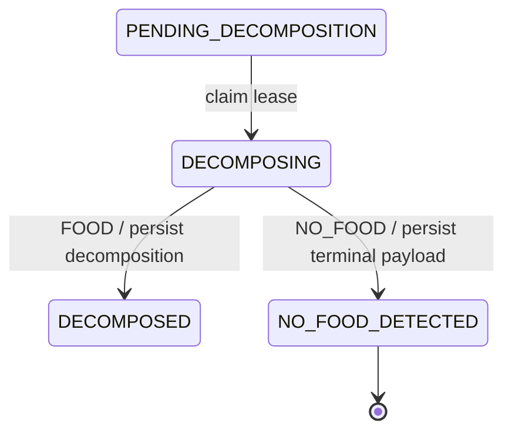

# Meal-analysis robustness

Status: Design recorded; implementation not started

Last reviewed: 2026-08-25

## Purpose

Make cloud text and image meal analysis handle non-food input, background
objects, invalid structured output, local development, and legacy stage rows
without redesigning the existing pipeline.

The current durable workflow remains documented in the
[meal-analysis state machine](../../backend/docs/meal-analysis-state-machine.md).
This plan is the canonical decision record for the robustness changes described
below. The state-machine document continues to describe production behavior
until implementation lands.

## Scope and change guardrails

This work is intentionally bounded:

- Extend the existing meal-analysis engine, session state, generated pipeline
  contract, and Flutter controller rather than replacing them.
- Reuse the existing engine entry points, validation contracts, and pipeline
  event types from the HTTP routes and local CLI.
- Keep one canonical schema per boundary: Zod for backend-only decomposition and
  durable snapshot validation, Kotlin/ML Kit annotations for on-device
  structured generation, and protobuf for cross-language transport. Keep the
  cloud and local decomposition cores semantically aligned through identical
  field names, descriptions, constraints, and shared contract fixtures rather
  than introducing a universal schema generator.
- Add no new service, queue, general workflow framework, provider abstraction,
  or nutrition database.
- Add no table solely for non-food results, USDA matches, CLI runs, or user
  profile context.
- Do not broaden this work into clarification idempotency, uncertainty
  versioning, error-taxonomy redesign, or nutrition-fallback policy.
- Stop and discuss before adding a new architectural layer, major dependency,
  database table, or refactor not required by this document.

Backward compatibility with old in-progress analysis snapshots is not a
requirement. Completed meal records must remain untouched.

## Current problems

The current decomposition contract and durable snapshot decoder disagree. The
LLM schema allows values such as an empty ingredient array or out-of-range
confidence, while later resume parsing rejects them. Those failures are then
reported as an analysis that cannot continue from its current state.

Image decomposition also has no explicit food/non-food classification. A
background electronic device can therefore become an ingredient and proceed to
USDA matching or nutrition fallback. The pipeline has no successful terminal
outcome for a request in which no food is present.

The current TypeScript calorie evaluator is not an accurate full-flow local
tool. It is text-only, does not perform real resume recovery, buffers the event
stream, uses handwritten permissive event types, and does not currently provide
the authentication required by the HTTP routes. It cannot test image input or
non-food outcomes.

The current implementation is in
[`nutritionEngineV2.ts`](../../backend/src/services/nutritionEngineV2.ts), the
LLM schemas are in
[`mealAnalysisPrompts.ts`](../../backend/src/services/mealAnalysisPrompts.ts),
and the existing evaluator is
[`calorie-estimation-eval.ts`](../../backend/src/scripts/calorie-estimation-eval.ts).

## Confirmed decisions

1. Add a successful terminal `NO_FOOD_DETECTED` state.
2. Emit a typed `NO_FOOD` pipeline event after the terminal payload is durable.
3. Generate the short visual meal name during the first image decomposition
   call and persist it.
4. Classify every detected candidate with `is_food`, an explanation, and a
   confidence value. The explanation must precede the confidence field in the
   structured-output order.
5. Do not maintain a closed list of non-food or exclusion categories. The
   explanation is bounded free text and is never used for control flow.
6. Give the LLM an ordered USDA lookup proposal consisting of a concise
   canonical name, aliases, and separate atomic preparation states. Actual
   database match identifiers and descriptions are not part of the persisted
   contract.
7. Capture the user's local date and time when the analysis session is created
   and provide it to decomposition as context for meal-type inference.
8. Keep the current meal-level `tip` semantics. The tip is generated during
   presentation from the grounded meal and is not an ingredient note.
9. Supply normalized user profile context to presentation so it can subtly
   influence the tip, without exposing or explicitly referring to that context.
10. Remove the second image/vision presentation pass. Presentation receives
    persisted meal data, not the original image.
11. Fix legacy null stages with an automatic application migration. No manual
    production SQL run or compatibility rollout is required.
12. Replace or clean inaccurate CLI behavior and documentation. Add one
    text-only full-flow local CLI that calls the same application functions used
    by the actual endpoints.
13. Use short localized `raw_name` values as client-visible ingredient names.
    USDA lookup proposals remain backend-only.
14. Remove row-level USDA match metadata from persisted analysis snapshots,
    generated client results, meal-analysis logs, and audit payloads. USDA
    database and local nutrition-cache identifiers remain internal.
15. Remove the hardcoded USDA semantic alias map and its alias-specific match
    path. Use the LLM's ordered canonical-name and alias proposals with the
    existing exact/fuzzy matcher instead.
16. Prompt positively to inventory the primary meal and relevant candidates;
    do not enumerate example ingredient categories or use negative scene-listing
    instructions.
17. Reuse the existing unidentified-meal configuration in the configurable meal
    tip sheet for no-food results. Do not introduce a separate no-food screen or
    sheet layout.
18. Use the localized equivalent of "No food was detected. Try another photo or
    description." as the generic no-food tip.
19. A small maintained Zod-to-JSON-Schema conversion dependency is acceptable;
    do not write a custom schema converter.
20. Cut every active meal-decomposition proposal producer and consumer over to
    V2: cloud text, cloud image, on-device text, on-device image, protobuf,
    Kotlin, Dart, backend TypeScript, HTTP payloads, generated bindings, tests,
    fixtures, and current documentation. Delete the V1 proposal definitions and
    paths instead of retaining compatibility types, adapters, dual parsing, or
    fallback behavior.
21. Use the same V2 semantic core for both on-device modalities. The local CLI
    remains text-only, but the existing on-device image producer must not remain
    on V1 or use a parallel schema.
22. Evaluate the canonical USDA identity and every alias, then select the best
    accepted preparation-aware candidate across all terms. Proposal order is a
    deterministic tie-breaker, not an early-stop rule.
23. Treat non-food candidates as transient provider output. Discard them after
    validation and outcome classification; do not persist, log, audit, resolve,
    clarify, or return their item details.
24. Have the application inject `schema_version`, proposal IDs, row IDs, and
    other transport/execution metadata. Do not ask cloud or on-device models to
    generate constant versions or identifiers.

## Target state-machine change

The normal food path remains unchanged. Decomposition gains one terminal branch:



`NO_FOOD_DETECTED` is successful and terminal, not an error. Its durable payload
should use the existing result storage as a discriminated result variant rather
than introducing another table. Once persisted:

- emit `NO_FOOD` with the analysis ID, outcome explanation, and confidence;
- replay the same event from `/resume`;
- skip USDA resolution, clarification, meal-type selection, presentation, and
  meal logging;
- never emit a food `RESULT` for the same analysis.

The generated pipeline contract must add the event and payload. The Flutter
controller must represent it as a terminal no-food state rather than a backend
failure.

## Decomposition input

Date and locale context are captured once when the session is created. Resume
must reuse the persisted values rather than recomputing the current time.

```ts
type DecompositionInputContext = {
  source: 'TEXT' | 'IMAGE';

  // ISO-8601 local date and time including its UTC offset.
  analysis_local_datetime: string;
  time_zone: string; // IANA timezone, for example Asia/Kolkata.
  locale: string;
  country_code: string | null;
};
```

The time of day is supporting evidence for `inferred_meal_type`. Explicit user
text and strong food evidence take precedence over the clock.

### Inventory direction

Use neutral, positive prompt language:

> Inventory the primary meal shown or described. Identify the relevant
> candidate items, decide whether each item belongs to the food being analyzed,
> and estimate portions only for items classified as food.

Do not provide an illustrative list of ingredient categories. Such a list can
be misread as exhaustive and cause omitted meal components. The prompt also
does not ask the model to inventory the entire scene.

## Decomposition structured output and V2 envelope

The property order is deliberate. Explanations appear before their associated
confidence values so the model produces the concise evidence first and scores
it second.

```ts
type GeneratedDecompositionOutputV2 = {
  outcome: 'FOOD' | 'NO_FOOD';
  outcome_reason: string;
  outcome_confidence: number;

  // Localized, preferably 2-6 words, and no more than 60 characters.
  // This is the visual meal name for image analysis.
  meal_name: string | null;

  items: Array<FoodItem | NonFoodItem>;

  inferred_meal_type:
    | 'BREAKFAST'
    | 'LUNCH'
    | 'DINNER'
    | 'SNACK'
    | 'UNKNOWN';
  meal_type_reason: string;
  meal_type_confident: boolean;
};

// Created by application code after generated-output validation and
// normalization. This metadata is not part of either provider schema.
type DecompositionProposalV2 = GeneratedDecompositionOutputV2 & {
  schema_version: 2;
};

type FoodItem = {
  // Short, localized, and suitable for direct display to the user.
  raw_name: string;

  is_food: true;
  is_food_reason: string;
  is_food_confidence: number;

  usda_lookup: {
    proposed_canonical_name: string;
    aliases: string[];
    preparation_states: string[];
  };

  portion: {
    kind: 'COUNT' | 'BULK' | 'PINCH';

    grams_estimated: number;
    min_grams: number;
    max_grams: number;

    count: number | null;
    per_unit_grams: number | null;
    per_unit_min_grams: number | null;
    per_unit_max_grams: number | null;

    size_specified_by_user: boolean;
  };
};

type NonFoodItem = {
  raw_name: string;

  is_food: false;
  is_food_reason: string;
  is_food_confidence: number;

  usda_lookup: null;
  portion: null;
};
```

### Required field descriptions

Every property in both generated-output schemas must carry a description. The
backend Zod descriptions must survive JSON-Schema conversion, and every local
Kotlin generated-output property must carry the equivalent ML Kit `Guide`
description. Application-injected envelope and transport fields must carry the
same documentation in their runtime/protobuf contracts. Descriptions are
contract text, not prompt-only comments.

| Field path | Required meaning |
| --- | --- |
| `schema_version` | Application-injected V2 proposal-contract version; this field is absent from cloud and on-device generated-output schemas. |
| `outcome` | Workflow-controlling result: `FOOD` when at least one item belongs to the meal being analyzed, otherwise terminal `NO_FOOD`. |
| `outcome_reason` | Concise input-grounded evidence for `outcome`, expressed as bounded free text without a closed exclusion-category vocabulary or internal reasoning. |
| `outcome_confidence` | Confidence in the overall food/no-food outcome from 0 through 1, produced after `outcome_reason`; it does not replace `outcome` as the control value. |
| `meal_name` | Localized, preferably two-to-six-word name for the whole meal, suitable for display and no longer than 60 characters; null for `NO_FOOD`. |
| `items` | Relevant candidate items that make up or may belong to the primary meal shown or described. |
| `inferred_meal_type` | Meal occasion inferred from the meal plus the server-supplied user-local date, time, timezone, and locale context. |
| `meal_type_reason` | Concise evidence for the meal occasion, produced before `meal_type_confident` and without exposing internal reasoning. |
| `meal_type_confident` | Whether the inferred meal occasion is sufficiently supported; false with `UNKNOWN` for `NO_FOOD`. |
| `items[].raw_name` | Short localized item name displayed to the user; it is not a USDA query, canonical database name, or matched description. |
| `items[].is_food` | Workflow-controlling classification of whether the candidate belongs to the primary food or meal being analyzed, not merely whether it is visible. |
| `items[].is_food_reason` | Concise input-grounded evidence for `is_food`; use bounded free text rather than a closed exclusion-reason list. |
| `items[].is_food_confidence` | Confidence in `is_food` from 0 through 1, produced after `is_food_reason`; no new hardcoded threshold overrides the boolean. |
| `items[].usda_lookup` | LLM-proposed retrieval input for a food item; null for non-food and never populated with an actual USDA match ID, score, or description. |
| `items[].usda_lookup.proposed_canonical_name` | Short generic English food identity optimized for a high chance of database retrieval, kept separate from preparation and any actual matched USDA description. |
| `items[].usda_lookup.aliases` | Ordered, unique alternative lookup identities for the same food; exclude the canonical name, different ingredients, preparation states, and joined alternatives. |
| `items[].usda_lookup.preparation_states` | Unique atomic nutrition-relevant states used separately for candidate ranking; use values such as `raw`, `boiled`, or `fried`, use the most specific nonredundant state, and emit an empty array when unknown. |
| `items[].portion` | Estimated total consumed portion for a food item; null for a non-food item. |
| `items[].portion.kind` | Portion representation: counted discrete pieces, bulk/continuous food, or a trace/pinch amount. |
| `items[].portion.grams_estimated` | Best estimate of total consumed grams across the entire item row, not grams per piece. |
| `items[].portion.min_grams` | Plausible lower bound for total consumed grams, no greater than `grams_estimated`. |
| `items[].portion.max_grams` | Plausible upper bound for total consumed grams, no less than `grams_estimated`. |
| `items[].portion.count` | Number of discrete pieces for `COUNT`; null for `BULK` and `PINCH`. |
| `items[].portion.per_unit_grams` | Best estimated grams per piece for `COUNT`; null for `BULK` and `PINCH`. |
| `items[].portion.per_unit_min_grams` | Plausible lower-bound grams per piece for `COUNT`; null for `BULK` and `PINCH`. |
| `items[].portion.per_unit_max_grams` | Plausible upper-bound grams per piece for `COUNT`; null for `BULK` and `PINCH`. |
| `items[].portion.size_specified_by_user` | Whether the user explicitly supplied the portion size; never infer this flag merely from a model estimate. |

### Schema constraints

- `outcome_reason`, `is_food_reason`, and `meal_type_reason` are concise evidence
  summaries, not open-ended internal reasoning.
- Reasons are between 1 and 240 characters.
- All confidence values are finite numbers from 0 through 1.
- `items` contains at most 20 entries.
- `raw_name` is between 1 and 120 characters.
- A food outcome contains at least one `FoodItem`.
- A no-food outcome contains no `FoodItem`, has `meal_name: null`, infers
  `UNKNOWN`, and sets `meal_type_confident: false`.
- `proposed_canonical_name` is a concise, generic English food identity chosen
  for high-recall database retrieval, not an attempted reproduction of a long
  USDA row description.
- A lookup proposal has at most five unique aliases. The aliases do not repeat
  the proposed canonical name, refer to the same food identity, and do not
  represent alternative ingredients or preparation states.
- `preparation_states` contains at most five unique atomic strings, each between
  1 and 40 characters. It is empty when preparation is unknown, never contains
  comma-delimited combined values, and remains separate from the canonical name
  and aliases. Prefer the most specific nonredundant value: use `["boiled"]`,
  not `["cooked", "boiled"]`; include multiple values only for independently
  meaningful states or sequential methods.
- `grams_estimated` is greater than zero and at most 5,000 grams.
- `min_grams` and `max_grams` are between zero and 5,000 grams, with
  `min_grams <= grams_estimated <= max_grams`.
- `COUNT` requires a positive count no greater than 20 and positive per-unit
  values. `BULK` and `PINCH` use null count and per-unit values.
- Non-food items always have null USDA lookup and portion data.
- Unknown fields are rejected.

These rules must be enforced by one canonical runtime schema for the generated
core. The provider JSON Schema and TypeScript type are derived from it. After
validation, application code filters transient non-food items, injects V2
metadata, and validates the normalized durable proposal before persistence.
Provider-only validation is insufficient.

The backend-only schema should use the repository's existing Zod validation
approach and a contained, maintained JSON-Schema conversion dependency. The
generated pipeline protobuf remains the cross-language wire source of truth.
The local V2 protobuf/Kotlin proposal uses the same semantic field paths,
descriptions, nullability, enums, ordering requirements, and bounds as the Zod
decomposition core. Transport-only metadata such as schema version, proposal
IDs, modality, model identity, execution origin, row IDs, or provenance is
injected after generation; it must not change the core's meaning.

Do not attempt to make one new IDL generate provider JSON Schema, runtime
refinements, database snapshots, TypeScript, Kotlin, and Dart; protobuf cannot
express the required runtime constraints, while Zod/JSON Schema does not supply
protobuf or ML Kit compatibility. A shared set of valid and invalid JSON
fixtures, plus generated-schema snapshots, must fail tests when the cloud and
local semantic contracts drift.

The `is_food` boolean, rather than a new hardcoded threshold over
`is_food_confidence`, controls whether an item enters nutrition resolution. The
confidence remains available for quality evaluation and future decisions.

### Normalization before persistence

Both cloud and on-device generated outputs may contain `NonFoodItem` values so
the classification is explicit and testable at the provider boundary. Once the
generated core is validated:

- derive and verify `outcome` from the classified items;
- discard every `NonFoodItem` and its reason/confidence from durable data;
- for `FOOD`, persist only normalized `FoodItem` values;
- for `NO_FOOD`, persist only the terminal outcome, reason, confidence, and
  required session metadata, with no candidate-item details; and
- inject the V2 schema version and application-owned identifiers.

Excluded candidates never reach USDA lookup, clarification, presentation,
client events, logs, traces, or audit payloads. This avoids retaining incidental
background-object details while preserving the classification guard at the
model boundary.

## USDA lookup and persistence

The LLM proposes search language; the database remains authoritative for
nutrition values.

- Try the concise `proposed_canonical_name` first, then the ordered aliases.
- Normalize and deduplicate identity terms before querying.
- Retrieve exact/fuzzy candidates using each short identity term. Use the
  atomic `preparation_states` separately while ranking candidates; do not turn
  a verbose identity-plus-preparation string into the primary trigram query.
- A preparation conflict must not be accepted merely because the food identity
  is an exact lexical match. Preparation helps choose among rows for the same
  food but never establishes food identity by itself.
- Evaluate candidates from the canonical identity and every alias before
  selecting a result. Deduplicate identical USDA rows, apply the existing
  quality and preparation-aware scoring, and choose the highest-scoring
  candidate that satisfies the matcher's acceptance thresholds.
- Break an equal-score tie by preferring the canonical identity, then earlier
  alias order, then the matcher's existing stable row ordering.
- Keep each term atomic; do not place comma-separated or `or`-joined alternatives
  in one string.
- Remove the hardcoded `ALIASES` map, `resolveAlias`, alias-only match type, and
  alias-specific tests from `usdaLookup.ts`.
- Do not replace the removed map with an alias JSON file or database table.
- Local proposal settlement consumes the same nested `usda_lookup` structure
  and uses the same canonical-name, alias, and preparation-aware candidate
  strategy.
- Retain dish and portion templates. They constrain decomposition and quantity;
  they are not the USDA semantic alias system being removed.
- Do not persist or expose the selected FDC ID, USDA matched description, match
  score, candidate rows, or similar row-level match metadata.
- Do not add those values to analysis logs or audit payloads. Aggregate matching
  metrics remain acceptable.
- Persist the food items' LLM-proposed lookup terms as part of decomposition
  and the calculated ingredient macros needed for durable resume and result
  replay.
- USDA database and local nutrition-pack internals are outside this persistence
  decision; this plan concerns cloud meal-analysis sessions and client results.

The resolved ingredient sent to the client uses `raw_name` directly:

```ts
type ClientResolvedIngredient = {
  row_id: string;
  raw_name: string;
  grams: number;
  macros: PipelineMacros;
  portion_kind: 'COUNT' | 'BULK' | 'PINCH';
  count: number | null;
  per_unit_grams: number | null;
};
```

It does not include canonical name, match type, FDC ID, USDA dataset version,
matched nutrients per 100 grams, or matched description. The same generated
client result shape applies to cloud and local results; the local nutrition pack
may continue using FDC IDs internally for cache identity and refreshes.

## Presentation without a second image pass

The initial image decomposition owns the visual meal name. Presentation must not
download or resend the image and must not replace the persisted meal name.

The existing `PRESENTING` state remains. It performs a text-only presentation
call using:

- persisted short meal name;
- final meal type;
- resolved ingredient names, portions, and calculated macros;
- total macros and calorie band;
- clarification/correction context;
- locale and country context; and
- normalized user profile context.

No USDA identifiers or selected database descriptions are included.

### User profile context

Use existing profile fields from
[`user.proto`](../../protos/user/user.proto). Derive and normalize the provider
input as follows:

```ts
type PresentationUserContext = {
  age_years: number | null;
  gender: 'MALE' | 'FEMALE' | 'OTHER' | null;

  current_weight_kg: number | null;
  target_weight_kg: number | null;
  bmi: number | null;

  weight_goal:
    | 'LOSE_WEIGHT'
    | 'MAINTAIN_WEIGHT'
    | 'GAIN_WEIGHT'
    | null;

  activity_level:
    | 'SEDENTARY'
    | 'LIGHTLY_ACTIVE'
    | 'MODERATELY_ACTIVE'
    | 'VERY_ACTIVE'
    | 'EXTREMELY_ACTIVE'
    | null;

  daily_calorie_goal_kcal: number | null;
};
```

- Derive age from date of birth; never send the birth date.
- Normalize current and target weight to kilograms.
- Calculate BMI server-side from normalized height and weight; do not send
  height when BMI is available for this purpose.
- Leave absent or invalid values null. Do not infer them.
- Present this as an ordinary user-context block. Do not tell the model to make
  the tip about BMI, weight, age, gender, or goals.
- Use the general guard: "Do not mention the personal context or explain
  personalization."
- Keep the tip practical, concise, specific to the analyzed food, and
  non-diagnostic.
- Do not add profile context to result data, analysis snapshots, traces, logs,
  or audit payloads.

### Presentation structured output

`tip` retains the current release meaning: one short helpful observation about
the analyzed food, informed by grounded ingredients and macros. It is not an
ingredient note.

```ts
type PresentationOutput = {
  quantity: string;
  tip: string;

  health: {
    health_score_reason: string;
    health_score: 'HEALTHY' | 'NEUTRAL' | 'UNHEALTHY';
  } | null;
};
```

Every presentation-output property must also have a provider-schema
description:

| Field path | Required meaning |
| --- | --- |
| `quantity` | Concise user-facing summary of the resolved total meal quantity, grounded only in persisted portion data. |
| `tip` | One short practical observation about the analyzed food, subtly informed by supplied context when useful; never mention the personal context, explain personalization, diagnose, or turn the tip into an ingredient note. |
| `health` | Optional food-level health assessment grounded in resolved ingredients and macros; null when it cannot be supported. |
| `health.health_score_reason` | Concise food-and-macro evidence for the assessment, produced before `health_score` and without referring to hidden profile context. |
| `health.health_score` | Overall food-level classification corresponding to `health_score_reason`. |

Descriptions must not instruct the model to discuss BMI, weight, age, gender,
or goals. Those values appear only as ordinary presentation input context.

The reason precedes the health score. Presentation no longer returns meal name
or meal type because both are already durable and authoritative.

## Client behavior

Add a generated `NO_FOOD` pipeline step and payload. The Flutter controller
creates a terminal no-food state containing the analysis ID, reason, and
confidence.

The existing configurable meal tip sheet already renders its unidentified-meal
branch when `MealDetectionResult.meal_identified` is false. Route the terminal
no-food state into that branch with the localized equivalent of "No food was
detected. Try another photo or description." and the existing image metadata.
Do not show the model's raw `outcome_reason`, and do not add a new screen, sheet
layout, nutrition controls, log controls, or retry control. A replayed `NO_FOOD`
event renders through the same branch.

## Automatic stage migration

Add one normal SQL migration under `backend/migrations/`. Application startup
already applies these migrations under the repository migration lock.

The migration will:

1. add `NO_FOOD_DETECTED` to the stage constraint;
2. backfill every `stage IS NULL` row from its existing durable payload;
3. use `PENDING_DECOMPOSITION` for a row with no later durable payload;
4. set `PENDING_DECOMPOSITION` as the column default; and
5. make `stage` non-null.

The SQL inference order must mirror the current stage inference logic: completed
result, meal-type question, clarification/ready state, resolved ingredients,
decomposition, then pending. Add a real PostgreSQL contract test for null-stage
automatic claims and the final non-null constraint.

No manual migration command, compatibility parser, or two-release rollout is
required. Existing incomplete snapshots may require a restart after deployment;
completed meal records remain intact.

## Local text CLI

Create one interactive TypeScript CLI for local development. The first version
supports text only.

The CLI must reuse the existing exported meal-analysis operations used by the
HTTP routes rather than duplicating endpoint paths, request shapes, pipeline
event interfaces, or state transitions. It should remain a thin adapter, not a
new application layer or local server framework.

Minimum behavior:

- accept text from an argument or interactive prompt;
- create or accept a client-stable analysis UUID;
- use the real local database and configured providers;
- print the actual generated pipeline events;
- prompt for clarification answers and meal type;
- call the shared resume operation for retryable interruptions;
- replay completed and no-food outcomes;
- support a supplied local user ID so ownership and optional profile context are
  exercised; and
- provide a machine-readable JSON mode for scripts.

The CLI does not initially support image upload, a mock provider framework, a
new HTTP client abstraction, or network-stream fault injection.

Clean the existing evaluation surface as part of the same work:

- stop describing `calories:eval` as a complete resumable pipeline until it is
  one;
- retain the useful dataset and pure scoring functions;
- make batch evaluation call the same shared text-flow driver where practical;
- remove handwritten permissive pipeline-event casts; and
- remove a package command or script if it remains nonfunctional and duplicates
  the new CLI rather than maintaining two competing tools.

## Explicitly unchanged or deferred

The following reviewed issues are not part of this implementation:

- Duplicate `/clarify` behavior after a successfully persisted forward
  transition remains unchanged.
- Persisted uncertainty and clarification options remain coupled to current
  deployed algorithms; no algorithm version is added.
- Public error messages, error taxonomy, retry metadata, and cleanup behavior
  are not redesigned in this work.
- USDA and fallback nutrition misses may continue using the current zero-macro
  behavior.
- Image input support for the new CLI is deferred.

The existing
[calorie-estimation reliability plan](../../backend/docs/calorie-estimation-reliability-plan.md)
continues to own broader calorie accuracy, matching quality, fallback, and
latency work.

## Bounded implementation sequence

Implementation should proceed as small, reviewable changes:

1. Add the canonical V2 generated core, application-injected envelope, field
   descriptions, and shared contract fixtures.
2. Replace the V1 proposal across protobuf, Kotlin, Dart, TypeScript, HTTP,
   local text/image producers, generated bindings, tests, and fixtures; remove
   all active V1 compatibility paths.
3. Extend generated pipeline contracts with the no-food event and result
   variant.
4. Add the terminal state and automatic migration.
5. Normalize generated output by discarding non-food candidates, injecting V2
   metadata, and routing no-food before USDA resolution.
6. Update USDA lookup to evaluate all canonical/alias candidates and rank with
   separate preparation states.
7. Remove image input from presentation, preserve the first-pass meal name, and
   add transient profile context.
8. Add the Flutter terminal state and minimal no-food UI.
9. Add the thin local text CLI and clean the old evaluation surface.
10. Update or condense current state-machine, local-inference, evaluator, and
    component documentation so no active guidance describes a V1 proposal.

If any step requires a new table, service, generalized state-machine framework,
large cross-repository refactor, or change to the explicitly deferred behavior,
pause and discuss it before proceeding.

## Acceptance coverage

At minimum, implementation needs tests for:

- schema-valid food and no-food decomposition;
- reason-before-confidence property ordering in the provider schema;
- bounds, required fields, unknown fields, gram ordering, and food/non-food
  discriminated variants;
- non-empty descriptions for every generated cloud and local schema field, with
  canonical-name, alias, and preparation-states contract parity;
- schema version and application-owned identifiers absent from both model
  output schemas and injected before durable V2 validation;
- cloud text/image and on-device text/image all producing the same V2 semantic
  core, with no active V1 proposal definition, parser, adapter, fixture, or
  documentation path remaining;
- text containing no food reaching `NO_FOOD_DETECTED`;
- an image containing food plus background objects resolving only food items;
- a non-food image skipping USDA, presentation, clarification, and logging;
- non-food candidate item details absent from snapshots, client events, logs,
  traces, and audit payloads;
- durable no-food replay from `/resume`;
- short first-pass meal names and no image in presentation messages;
- profile normalization, null handling, BMI/age derivation, and absence from
  logs/results;
- no persisted or client-visible FDC ID, selected USDA description, or match
  score;
- all LLM-proposed canonical/alias terms evaluated before selecting the best
  accepted exact/fuzzy candidate, with no curated USDA alias map or alias match
  type;
- local V2 proposal lookup using ordered aliases and separate atomic
  preparation-aware ranking after removal of the curated alias path;
- null-stage migration and PostgreSQL automatic claims;
- client terminal no-food rendering through the existing unidentified-meal tip
  sheet configuration; and
- CLI start, clarification, meal type, resume, completed replay, no-food replay,
  and JSON output using shared pipeline types.

No implementation should begin until this document is reviewed as the agreed
scope.
